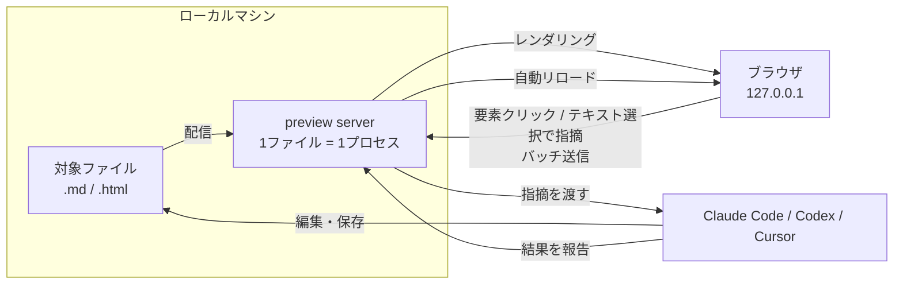
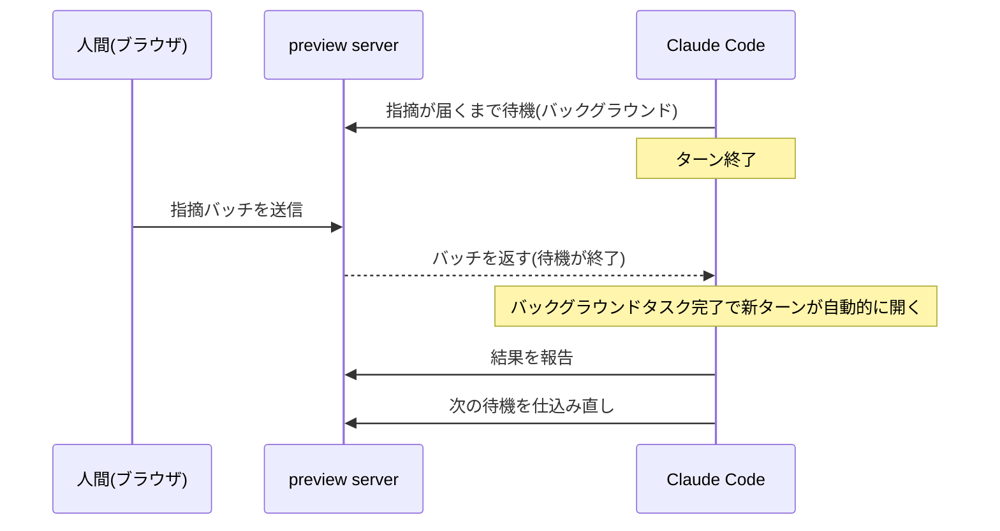
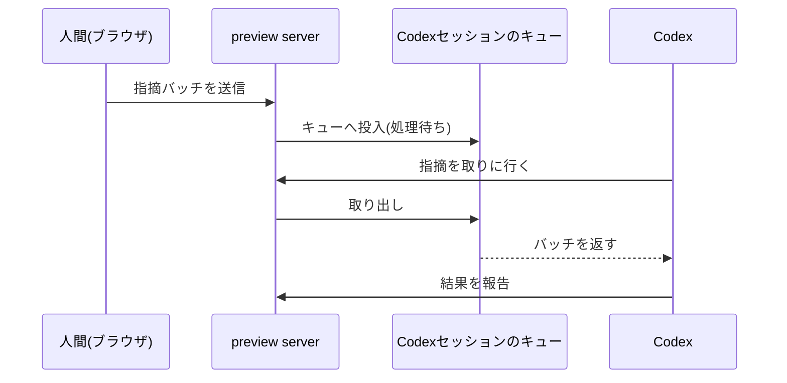
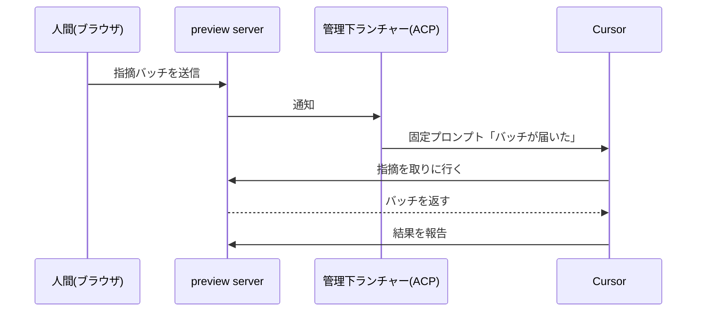
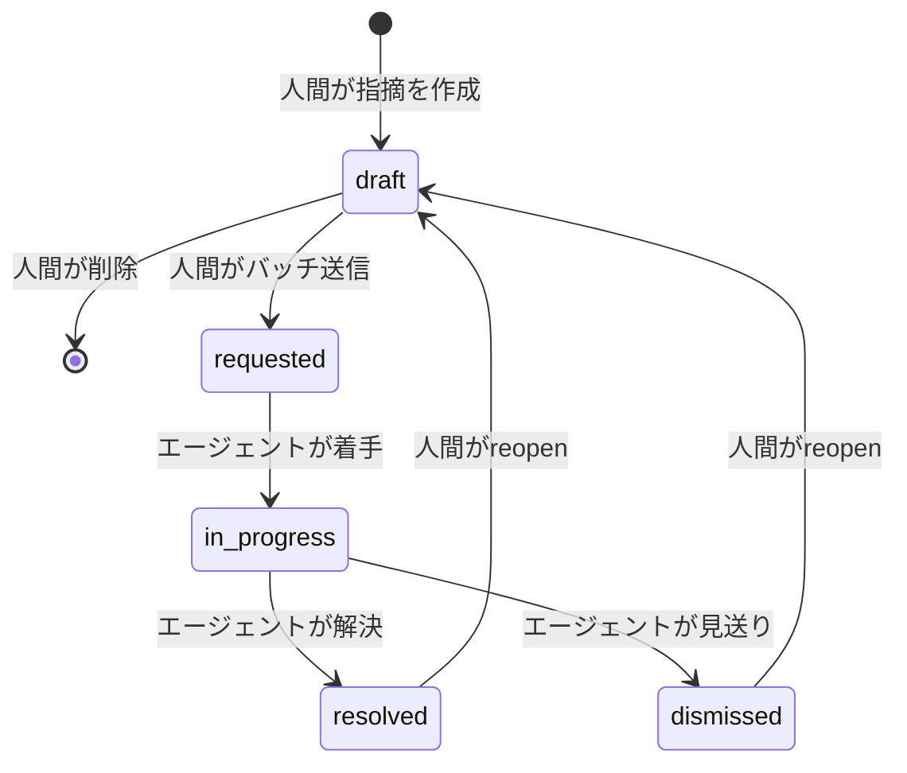

## これはなに？

今年の5月ごろから、Artifact Share というサービスを自分で使うためにソース公開で作り続けています。AIエージェントが作ったHTMLやMarkdownをURLで共有するものです。そのCLIに `preview` というローカルコマンドを追加しました。ブラウザ上でファイルの要素をクリックして指摘を書くと、Claude Code・Codex・Cursor がファイルを直し、ブラウザが自動リロードで結果を見せます。動画が一番早いです。

@[youtube](ooC8CCVog9A)

ここから先は仕組みの話です。サインイン・アップロード不要のローカル機能で、実装は公開しています。

https://github.com/artifactshare/artifactshare/pull/198

作ってみて核になった設計判断は2つでした。

- 会話セッションを邪魔せずにエージェントを起こす合図は、3つのエージェントで別々に作るしかなかった
- 常駐デーモンは要らなかった。1ファイル1プロセスで足りる

## 全体像

`preview <file>` を実行すると、そのプロセス自体がローカルサーバーになります。

```sh
# 人間側: プレビューを開く(ブラウザが開き、以後は画面上で指摘する)
npx @artifactshare/cli preview ./report.html

# エージェント側: 1周はこの2コマンド
npx @artifactshare/cli preview next --wait 90   # 指摘が届くまで待って受け取る
npx @artifactshare/cli preview done --stdin     # 直した結果を報告する
```

指摘はまとめて1バッチで送信します。エージェントの1周は「指摘を取りに行く(`next`) → 編集・保存 → 結果を報告する(`done`)」です。



公開URLの発行は viewer の「共有する」を押したときだけ。ローカルの指摘履歴は共有に含まれません。

## エージェントを次のターンへ進ませる、3つの別解

一番苦労したのがここです。こだわったのは、待っている間も会話セッションを邪魔しないこと。「指摘が届くまで待つ」コマンドをフォアグラウンドで実行させれば確実に動きますが、待っている間ターンが塞がり、エージェントに他の作業を頼めなくなります。理想は、普段どおり会話しながら、指摘が届いた瞬間にエージェントが自分で動き出すこと。ところが、そのために使える仕組みがエージェントごとに違いました。3つで実際に動かして確かめた結果、こう整理できました。

| エージェント | 使えた仕組み |
|---|---|
| Claude Code | バックグラウンドタスク完了時の自動ターン再開 |
| Codex | 実行中セッションへのメッセージのキュー投入 |
| Cursor | ACPで常駐させた専用セッションへの固定プロンプト送信 |
| (共通の保険) | 「届くまで待つ」コマンドをフォアグラウンドで実行。ターンは塞がる |

仕組みの名前は覚えなくて大丈夫です。以下、それぞれの節の冒頭に「何を使うか」を書いてあります。

### Claude Code: バックグラウンドタスクの完了を使う

使うのは、Bashコマンドをバックグラウンドで実行できる標準機能です。Claude Codeはバックグラウンドタスクが完了すると、新しいターンを自動で開きます。そこで「指摘が届くまで待つ」コマンド(`preview next --wait 3600`)をバックグラウンドに仕込んでおきます。指摘が届いた瞬間にコマンドが終了し、Claude Codeが起きてファイルを直しにいきます。修正後は次の待機を仕込み直してループが続きます。



### Codex: 実行中セッションのキューに直接差し込む

Codexにはバックグラウンド完了でターンを再開する仕組みがなく([openai/codex#32188](https://github.com/openai/codex/issues/32188))、Claude Codeの手は使えません。代わりに使うのは、Codex CLIが持つ「実行中セッションへのメッセージのキュー投入」です。previewサーバーが起動時にCodexのセッションIDを検出しておき、指摘が届いたらそのセッションへ「届いた」というメッセージを積みます。エージェントが指摘を取りに来るまでバッチは消費されず、セッションが終わっていても `codex resume` で再開すれば受け取れます。



### Cursor: 管理下のACPセッションへ固定プロンプトを送る

Cursorにも自動再開の仕組みはなく、IDEチャットは外部から起こす手段自体がありません。使ったのは ACP(Agent Client Protocol)。エディタとエージェントをつなぐ共通プロトコルで、外部から会話の作成・復元・プロンプト送信ができます。previewに同梱した専用ランチャーが、ACP経由の専用セッションを1ワークスペースに1つ常駐させます。指摘が届くと、ランチャーは「バッチが届いた」という固定プロンプトだけをそのセッションへ送ります。本文はエージェントが自分で取りに行き、使用中なら通知は保留され、バッチは保存されたまま残ります。



3つに共通させた判断が1つあります。通知には指摘の本文もアンカーも乗せず、「届いた」という合図だけを運ぶこと。中身はエージェントが毎回取りに行く形にしたので、通知経路が漏れても指摘は流出しません。同じように外部イベント待ちのCLIを作る場合は、実装をそのまま参考にできると思います。

ここから先は、preview そのものの設計メモです。

## 常駐デーモンを持たない

当初は常駐デーモンで複数セッションを束ねる構成も検討しましたが、やめました。`preview <file>` のコマンド自身がサーバーになり、Ctrl-Cで終わる。同じファイルへの2回目の `preview` は既存セッションへ再接続する。それだけの作りです。

理由は、用途を「1ファイルを何度も直す反復ループ」に絞ったこと。すると複数セッションの横断発見・多重起動のロック・死んだプロセスの回収といった、デーモンが背負う寿命管理が丸ごと要らなくなります。

## 指摘の場所を覚えておく: anchorの3種類

指摘の位置は、3種類のanchorとして保存する形に落ち着きました。

```ts
type PreviewAnchor =
  | { kind: 'artifact' }
  | {
      kind: 'text'
      state: 'attached' | 'orphaned'
      quotedText: string
      prefixText: string
      suffixText: string
      cssPath: string | null
    }
  | {
      kind: 'element'
      state: 'attached' | 'orphaned'
      selector: string
      label: string // 例: button "送信"
      contextText: string // クリック時点の周辺テキスト
    }
```

こだわったのは `element` をCSSセレクタ単独にしないことです。エージェントの編集でセレクタの指す先がずれても、ラベルと周辺テキストを突き合わせれば位置を再解決できます。再解決に失敗したら `orphaned` に落とし、誤った場所には紐づけない。座標(boundingBox)は編集でずれる値なので、保存せず表示のたびに計算することにしました。

## 指摘は状態を持つ

指摘の状態は5つに整理しました。draft側の遷移は人間だけ、requested以降の前進はエージェントだけ、と主体を固定しています。



遷移はバッチ単位です。エージェントは1バッチを1回の編集でまとめて直すので、1件ずつは刻みません。reopenのたびに `generation` という番号が増え、エージェントの報告はこの番号と紐づきます。古い番号の報告は無視されるので、重複報告しても二重適用されません。

## まとめ

16箇所の指摘をCodexとブラウザの往復だけでさばいた実例です。

https://artifactshare.com/a/y531hqc6jf

作ってみてわかったのは、CLIとデータ契約は共通にできても、エージェントを起こす合図だけは共通化できないことでした。同じ体験のために、エージェントの数だけ起動経路を作ることになりました。

この部分が今後標準化される見込みも、正直薄そうだと感じています。Claude Code の Channel のような面白そうな仕組みも出てきていますが、まだ使えませんでしたし、使えたとしても各社独自の路線になりそうです。残念ですが、当面はエージェントが増えるたびに起動経路を1本ずつ足していくことになりそうです。
