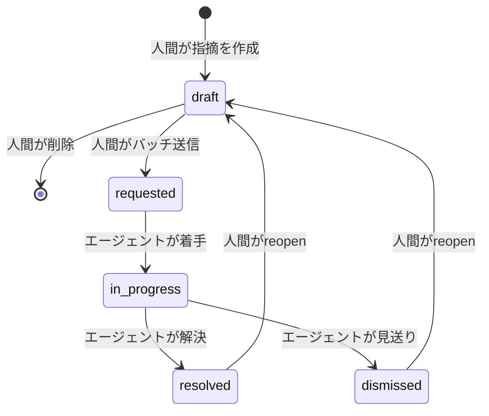
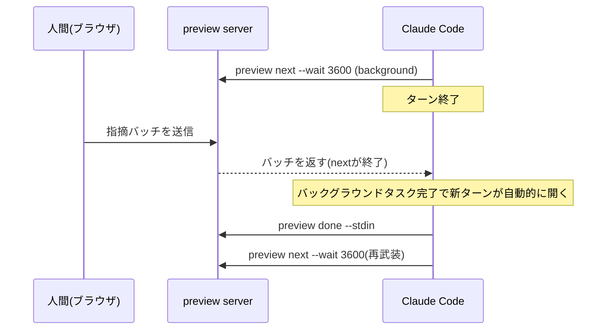
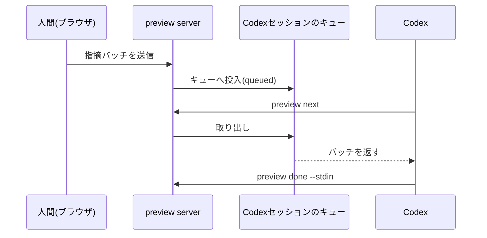
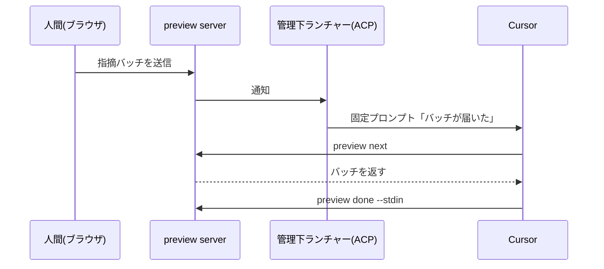

## これはなに？

Artifact Share は、AIエージェントが作ったHTMLやMarkdownをURLで共有するサービスです。そのCLIに `preview` というローカルコマンドを追加しました。ブラウザで開いたファイルの要素をクリックして指摘を書くと、その指摘が Claude Code・Codex・Cursor のいずれかのエージェントに届きます。エージェントがファイルを直接修正し、保存を検知するとブラウザは自動でリロードして、直った箇所がその場でわかります。指摘をターミナルの言葉に翻訳し直す手間がありません。

@[youtube](ooC8CCVog9A)

サインイン・アップロードなしで動くローカル機能で、実装は公開リポジトリにあります。

https://github.com/artifactshare/artifactshare/pull/198

この記事では `preview` の完成形を図解中心で説明します。核になる技術判断は次の3つです。

- エージェントを次のターンへ進ませる合図が、Claude Code・Codex・Cursor で全部別物になっています
- 常駐デーモンを持たず、1ファイル1プロセスで完結させています
- 認証トークンを使わず、Webブラウザの標準的な挙動だけでローカルサーバーを守っています

## 全体像

`preview <file>` を実行すると、そのプロセス自体がローカルサーバーになります。ブラウザは公開ページと同じ見た目の viewer で対象ファイルを表示し、要素クリックやテキスト選択で指摘を書きます。指摘はまとめて1バッチとして送信され、エージェントは `preview next` で受け取り、ファイルを編集して `preview done` で結果を報告します。ファイルの保存はサーバーが検知し、ブラウザを自動でリロードします。


共有したくなったら viewer の「共有する」から、preview とは別ドメインで動く共有ダイアログを開き、そこで初めて公開URLが発行されます。ローカルの指摘履歴は共有には含まれません。

## 常駐デーモンを持たない

複数の `preview` セッションを横断管理する中央プロセスは存在しません。`preview <file>` を実行するたびにそのコマンド自身がサーバーになり、Ctrl-Cで終わります。セッションを識別するキーは、対象ファイルの実パスと起動時の実行コンテキスト（どのプロファイル・どの作業ディレクトリから起動したか）です。同じファイルへの2回目の `preview` は既存セッションへ再接続します。実行コンテキストが違えば別セッション扱いになり、意図しない再接続は起きません。

用途は「1ファイルを何度も直す反復ループ」に閉じています。そのため、複数セッションの横断発見・多重起動時のロック・停止したプロセスの回収といった、常駐デーモンが本来背負う寿命管理の大半が要らなくなります。

## 指摘の場所を覚えておく: anchorの3種類

指摘は discriminated union（値の種類ごとに形が変わるTypeScriptのunion型）の `PreviewAnchor` として保存されます。

```ts
type PreviewAnchor =
  | { kind: 'artifact' }
  | {
      kind: 'text'
      state: 'attached' | 'orphaned'
      quotedText: string
      prefixText: string
      suffixText: string
      cssPath: string | null
    }
  | {
      kind: 'element'
      state: 'attached' | 'orphaned'
      selector: string
      label: string // 例: button "送信"
      contextText: string // クリック時点の周辺テキスト
    }
```

この型定義は公開リポジトリのファイルそのものです。

https://github.com/artifactshare/artifactshare/blob/main/packages/cli/src/preview/contract.ts

`artifact` はファイル全体への指摘、`text` はMarkdown向けのテキスト選択、`element` はHTML向けの要素クリックに対応します。`element` はCSSセレクタだけでなく、`button "送信"` のような人間可読ラベルと、クリック時点の周辺テキストも一緒に持ちます。エージェントがファイルを編集してセレクタの指す先がずれても、ラベルと周辺文脈を突き合わせて指摘位置を再解決できます。再解決できなければ `orphaned` として扱い、誤った場所に紐付けません。

要素の座標(boundingBox)は保存しません。表示のたびに計算し直す値であり、永続化すると編集後にずれて誤情報になるからです。

## 指摘は状態を持つ

指摘は5状態のライフサイクルを持ち、遷移できる主体が状態ごとに固定されています。draft側の遷移は人間だけが行い、requested以降の前進はエージェントのCLI呼び出しだけが行います。



遷移はバッチ単位でまとめて起きます。エージェントは1バッチをまとめて読み、1回の編集・保存で複数件を直すため、1件ずつ着手・解決が刻まれることはありません。`resolved` や `dismissed` になった指摘は、人間が追記して `draft` へ差し戻せます。この「reopen」のたびに `generation` という番号が増え、`preview done` の報告はその番号と紐づきます。古い番号での報告は無視されるため、同じバッチを重複報告しても二重に適用されません。

## エージェントを次のターンへ進ませる、3つの別解

`preview next` と `preview done` というCLIの形は共通でも、「指摘が来たことをエージェントに伝える」手口は各エージェントで別物になります。「待つ」「起動される」の仕組みがそもそも違うからです。各エージェントの挙動はCLIの公開READMEにも記載があります。

https://github.com/artifactshare/artifactshare/blob/main/packages/cli/README.md

### Claude Code: バックグラウンドタスクの完了を使う

Claude Codeは、コマンドをターンの外で実行し続けられる「バックグラウンドタスク」という仕組みを持ちます。ここへ `preview next --wait 3600` を仕込んでおくと、人間が指摘を送った瞬間にバッチが届いて `next` が終了します。Claude Codeはバックグラウンドタスクの完了を検知すると新しいターンを自動的に開くので、そのままファイルを直しにいきます。修正後は同じ手順で次の `next --wait` を再度仕込み、ループが続きます。タイムアウトで終わった `next` は再武装しません。



### Codex: 実行中セッションのキューに直接差し込む

Codexでは、trusted thread（実行中のセッション）を検出できた場合、指摘バッチをそのセッションのキューへ直接積みます。人間がバッチを送った時点で投入は完了しますが、状態は "queued" のままで、エージェントが実際に `preview next` を呼ぶまで消費されません。セッションが終了していても、`codex resume` で再開すれば同じバッチを受け取れます。



### Cursor: 管理下のACPセッションへ固定プロンプトを送る

Cursorは ACP(Agent Client Protocol)経由の専用セッションを1ワークスペースにつき1つ持ちます。指摘バッチが届くと、専用ランチャーが「バッチが届いた」という固定プロンプトだけをそのセッションへ送り、本文はエージェント自身が `preview next` で取りに行きます。セッションがbusyなら通知は保留され、バッチはそのまま保存されます。通常の `cursor-agent` 実行中ターンでは、環境変数でforegroundの待受コマンドに切り替えられます。素のCursor IDEチャットは自動再開の対象外で、人間が明示的に呼びかける運用になります。



3つに共通する設計判断があります。人間への通知チャネルには指摘の本文もアンカーも乗せません。運ぶ先がCodexのキューであれCursorへの固定プロンプトであれ、内容は「バッチが届いた」という合図だけで、実際の指摘は毎回 `preview next` を通じて取得します。通知経路が漏れても指摘の中身は流出しません。

## ローカルサーバーを、トークンなしで守る

想定する脅威は2つに絞られています。ブラウザで開いている別のWebページがlocalhostの `preview` サーバーへ勝手に書き込むdrive-by攻撃と、DNS rebindingです。対策はトークン発行ではなく、Webブラウザの標準的な挙動の組み合わせで足りています。

- サーバーはloopback(127.0.0.1)にのみbindします
- `Host` ヘッダを検証し、DNS rebindingで別ホスト名から来たリクエストを拒否します
- 書き込み系のAPIは独自ヘッダ(`x-artifactshare-preview`)を必須にします。これによりクロスオリジンからのリクエストには必ずCORSプリフライトが発生し、サーバーはCORSヘッダを一切返さないため書き込みは失敗します
- 読み取り系はブラウザのSame-Origin Policyがそのままブロックします
- セッションIDは16進数16文字であることをファイルシステム操作の前に検証します

トークンの発行・保存・URLへの埋め込みが一切不要になり、その分だけ漏えい経路も消えます。

## まとめ

`preview` を使って16箇所の指摘をCodexとブラウザの往復だけでさばいた実例があります。

https://artifactshare.com/a/y531hqc6jf

ブラウザとエージェントの間は共通のCLIとデータ契約でつながっていますが、「エージェントを次のターンへ進ませる合図」だけは3つのエージェントの実装に合わせて別々に作られています。同じユーザー体験を実現するために、エージェントの数だけ違う起動経路を用意する必要がありました。
