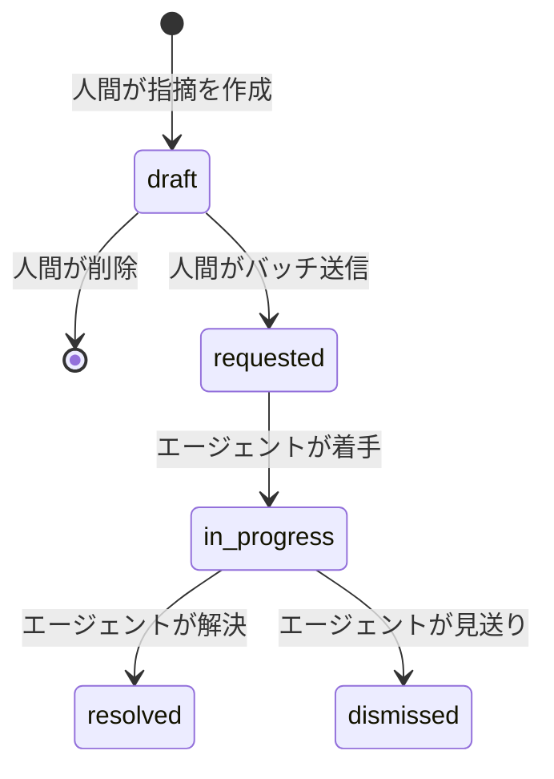
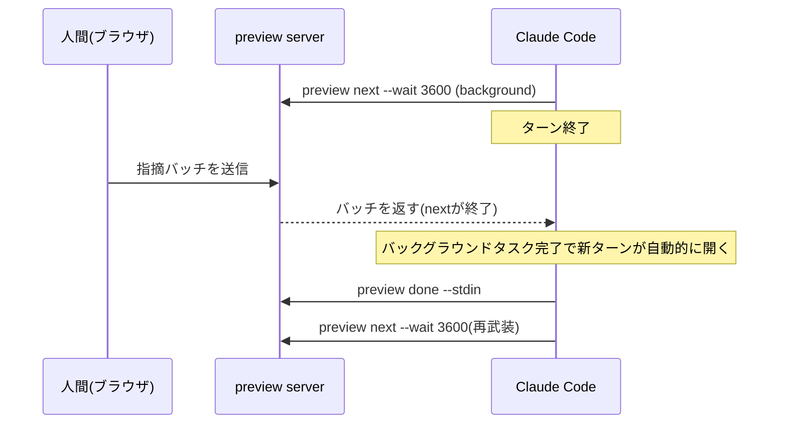
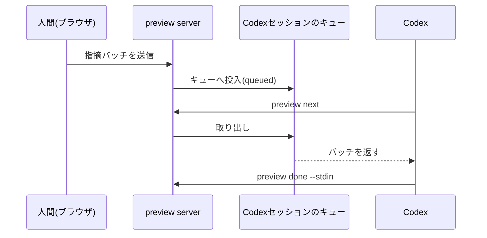
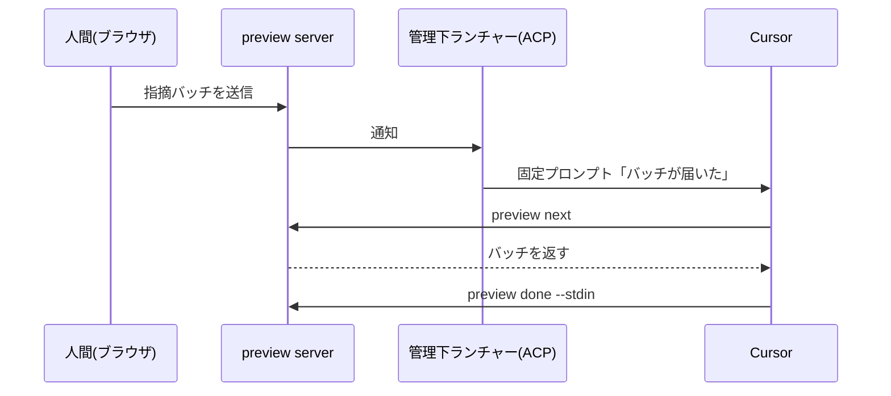

## これはなに？

Artifact Share の CLI に `preview` というローカルコマンドを追加した。ブラウザで開いた HTML や Markdown の要素をクリックして指摘を書くと、その指摘が Claude Code・Codex・Cursor のいずれかのエージェントに届く。エージェントがファイルを直接修正し、保存を検知するとブラウザは自動でリロードして、直った箇所がその場でわかる。指摘をターミナルの言葉に翻訳し直す手間がない。

サインイン・アップロードなしで動くローカル機能で、実装は公開リポジトリにある。

https://github.com/artifactshare/artifactshare/pull/198

この記事では `preview` の完成形を図解中心で説明する。核になる技術判断は次の3つ。

- エージェントを次のターンへ進ませる合図が、Claude Code・Codex・Cursor で全部別物になっている
- 常駐デーモンを持たず、1ファイル1プロセスで完結させている
- 認証トークンを使わず、Webブラウザの標準的な挙動だけでローカルサーバーを守っている

## 全体像

`preview <file>` を実行すると、そのプロセス自体がローカルサーバーになる。ブラウザは公開ページと同じ見た目の viewer で対象ファイルを表示し、要素クリックやテキスト選択で指摘を書く。指摘はまとめて1バッチとして送信され、エージェントは `preview next` で受け取り、ファイルを編集して `preview done` で結果を報告する。ファイルの保存はサーバーが検知し、ブラウザを自動でリロードする。


指摘したくなったら viewer の「共有する」から、preview とは別ドメインで動く共有ダイアログを開き、そこで初めて公開URLが発行される。ローカルの指摘履歴は共有には含まれない。

## 常駐デーモンを持たない

複数の `preview` セッションを横断管理する中央プロセスは存在しない。`preview <file>` を実行するたびにそのコマンド自身がサーバーになり、Ctrl-Cで終わる。対象ファイルの実パスと起動時の認証情報（プロファイル・作業ディレクトリなど）をキーにセッションを識別し、同じファイルへの2回目の `preview` は既存セッションへ再接続する。認証情報が一致しない場合は別セッション扱いになり、他アカウントのセッションへ乗り入れることはない。

用途は「1ファイルを何度も直す反復ループ」に閉じている。そのため、複数セッションの横断発見・多重起動時のロック・停止したプロセスの回収といった、常駐デーモンが本来背負う寿命管理の大半が要らなくなる。

## 指摘の場所を覚えておく: anchorの3種類

指摘は discriminated union の `PreviewAnchor` として保存される。

```ts
type PreviewAnchor =
  | { kind: 'artifact' }
  | {
      kind: 'text'
      state: 'attached' | 'orphaned'
      quotedText: string
      prefixText: string
      suffixText: string
      cssPath: string | null
    }
  | {
      kind: 'element'
      state: 'attached' | 'orphaned'
      selector: string
      label: string // 例: button "送信"
      contextText: string // クリック時点の周辺テキスト
    }
```

`artifact` はファイル全体への指摘、`text` はMarkdown向けのテキスト選択、`element` はHTML向けの要素クリックに対応する。`element` はCSSセレクタだけでなく、`button "送信"` のような人間可読ラベルと、クリック時点の周辺テキストも一緒に持つ。エージェントがファイルを編集してセレクタの指す先がずれても、ラベルと周辺文脈を突き合わせて指摘位置を再解決できる。再解決できなければ `orphaned` として扱い、誤った場所に紐付けない。

要素の座標(boundingBox)は保存しない。表示のたびに計算し直す値であり、永続化すると編集後にずれて誤情報になるからだ。

## 指摘は状態を持つ

指摘は5状態のライフサイクルを持ち、遷移できる主体が状態ごとに固定されている。draft側の遷移は人間だけが行い、requested以降の前進はエージェントのCLI呼び出しだけが行う。



遷移はバッチ単位でまとめて起きる。エージェントは1バッチをまとめて読み、1回の編集・保存で複数件を直すため、1件ずつ着手・解決が刻まれることはない。`preview done` の報告は `generation`（指摘が reopen されるたびに増える番号）と紐づいており、同じバッチを重複報告しても二重に適用されない。

## エージェントを次のターンへ進ませる、3つの別解

`preview next` と `preview done` というCLIの形は共通でも、「指摘が来たことをエージェントに伝える」手口は各エージェントで別物になる。「待つ」「起動される」の仕組みがそもそも違うからだ。

### Claude Code: バックグラウンドタスクの完了を使う

Claude Code は `preview next --wait 3600` をバックグラウンドタスクとして実行しておく。人間が指摘を送るとバッチが届いて `next` が終了し、Claude Codeはバックグラウンドタスク完了時に新しいターンを自動的に開くので、そのままファイルを直しにいく。修正後は同じ手順で次の `next --wait` を再度仕込み、ループが続く。タイムアウトで終わった `next` は再武装しない。



### Codex: 実行中セッションのキューに直接差し込む

Codexでは、trusted thread（実行中のセッション）を検出できた場合、指摘バッチをそのセッションのキューへ直接積む。人間がバッチを送った時点で投入は完了するが、状態は "queued" のままで、エージェントが実際に `preview next` を呼ぶまで消費されない。セッションが終了していても、`codex resume` で再開すれば同じバッチを受け取れる。



### Cursor: 管理下のACPセッションへ固定プロンプトを送る

Cursorは ACP(Agent Client Protocol)経由の専用セッションを1ワークスペースにつき1つ持つ。指摘バッチが届くと、専用ランチャーが「バッチが届いた」という固定プロンプトだけをそのセッションへ送り、本文はエージェント自身が `preview next` で取りに行く。セッションがbusyなら通知は保留され、バッチはそのまま保存される。通常の `cursor-agent` 実行中ターンでは、環境変数でforegroundの待受コマンドに切り替えられる。素のCursor IDEチャットは自動再開の対象外で、人間が明示的に呼びかける運用になる。



3つに共通する設計判断がある。人間への通知チャネルには指摘の本文もアンカーも乗せない。運ぶ先がCodexのキューであれCursorへの固定プロンプトであれ、内容は「バッチが届いた」という合図だけで、実際の指摘は毎回 `preview next` を通じて取得する。通知経路が漏れても指摘の中身は流出しない。

## ローカルサーバーを、トークンなしで守る

想定する脅威は2つに絞られている。ブラウザで開いている別のWebページがlocalhostの `preview` サーバーへ勝手に書き込むdrive-by攻撃と、DNS rebindingだ。対策はトークン発行ではなく、Webブラウザの標準的な挙動の組み合わせで足りている。

- サーバーはloopback(127.0.0.1)にのみbindする
- `Host` ヘッダを検証し、DNS rebindingで別ホスト名から来たリクエストを拒否する
- 書き込み系のAPIは独自ヘッダ(`x-artifactshare-preview`)を必須にする。これによりクロスオリジンからのリクエストには必ずCORSプリフライトが発生し、サーバーはCORSヘッダを一切返さないため書き込みは失敗する
- 読み取り系はブラウザのSame-Origin Policyがそのままブロックする
- セッションIDは16進数16文字であることをファイルシステム操作の前に検証する

トークンの発行・保存・URLへの埋め込みが一切不要になり、その分だけ漏えい経路も消える。

## 実物

このプレビュー機能を紹介するスライド自体も、`preview` を使ってCodexとブラウザの往復だけで16箇所を直しながら作った。

https://artifactshare.com/a/y531hqc6jf

## まとめ

ブラウザとエージェントの間は共通のCLIとデータ契約でつながっているが、「エージェントを次のターンへ進ませる合図」だけは3つのエージェントの実装に合わせて別々に作られている。同じユーザー体験を実現するために、エージェントの数だけ違う裏口を用意する必要があった。
