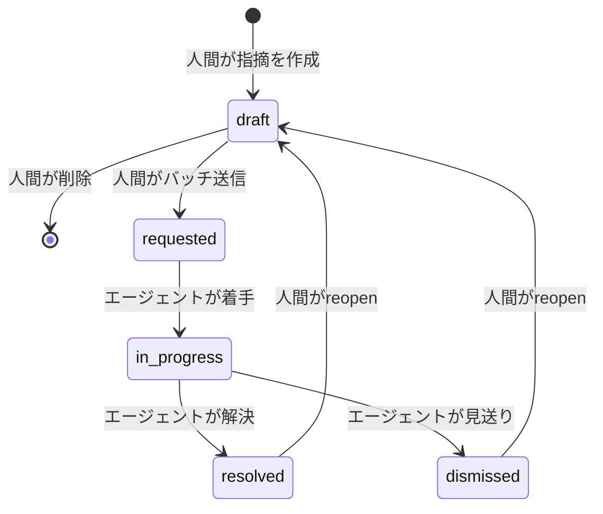
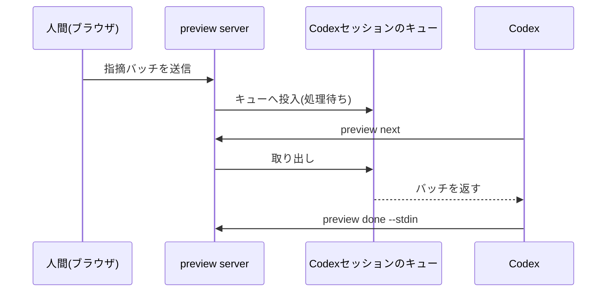
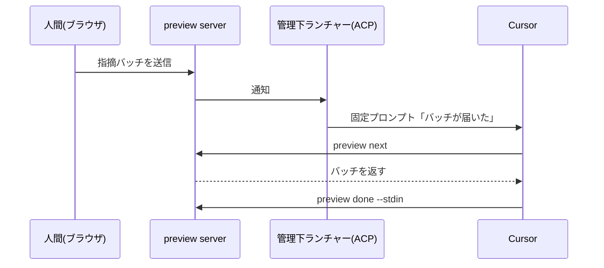

## これはなに？

Artifact Share は、AIエージェントが作ったHTMLやMarkdownをURLで共有するサービスです。そのCLIに `preview` というローカルコマンドを追加しました。ブラウザ上でファイルの要素をクリックして指摘を書くと、Claude Code・Codex・Cursor がファイルを直し、ブラウザが自動リロードで結果を見せます。動画が一番早いです。

@[youtube](ooC8CCVog9A)

ここから先は仕組みの話です。サインイン・アップロード不要のローカル機能で、実装は公開されています。

https://github.com/artifactshare/artifactshare/pull/198

核になる技術判断は3つです。

- エージェントを起こす合図が、3つのエージェントで全部別物
- 常駐デーモンなし。1ファイル1プロセス
- 認証トークンなし。ブラウザの標準挙動だけでローカルサーバーを守る

## 全体像

`preview <file>` を実行すると、そのプロセス自体がローカルサーバーになります。指摘はまとめて1バッチで送信し、エージェントの1周は `preview next` で受け取り → 編集・保存 → `preview done` で報告、の2手です。


公開URLの発行は viewer の「共有する」を押したときだけ。ローカルの指摘履歴は共有に含まれません。

## 常駐デーモンを持たない

中央の常駐プロセスはありません。`preview <file>` のコマンド自身がサーバーになり、Ctrl-Cで終わります。同じファイルへの2回目の `preview` は既存セッションへ再接続します。

用途を「1ファイルを何度も直す反復ループ」に絞ったからです。複数セッションの横断発見・多重起動のロック・死んだプロセスの回収といった、デーモンが背負う寿命管理が丸ごと要らなくなります。

## 指摘の場所を覚えておく: anchorの3種類

指摘の位置は3種類のanchorで保存します。

```ts
type PreviewAnchor =
  | { kind: 'artifact' }
  | {
      kind: 'text'
      state: 'attached' | 'orphaned'
      quotedText: string
      prefixText: string
      suffixText: string
      cssPath: string | null
    }
  | {
      kind: 'element'
      state: 'attached' | 'orphaned'
      selector: string
      label: string // 例: button "送信"
      contextText: string // クリック時点の周辺テキスト
    }
```

ポイントは `element` をCSSセレクタ単独にしないことです。エージェントの編集でセレクタの指す先がずれても、ラベルと周辺テキストを突き合わせて位置を再解決できます。再解決に失敗したら `orphaned` に落とし、誤った場所に紐づけません。座標(boundingBox)は編集でずれる値なので保存せず、表示のたびに計算します。

## 指摘は状態を持つ

指摘は5状態を移ります。draft側の遷移は人間だけ、requested以降の前進はエージェントだけ、と主体を固定しています。



遷移はバッチ単位です。エージェントは1バッチを1回の編集でまとめて直すので、1件ずつは刻みません。reopenのたびに `generation` という番号が増え、`preview done` の報告はこの番号と紐づきます。古い番号の報告は無視されるので、重複報告しても二重適用されません。

## エージェントを次のターンへ進ませる、3つの別解

CLIの形は共通でも、「指摘が届いたことをエージェントに伝える」方法は3つとも別物です。最低限の共通手段は `preview next --wait N` をフォアグラウンドで待たせることですが、ターンを塞ぎます。理想は「届いた瞬間にエージェントが自分で動き出す」こと。その仕組みがエージェントごとに違うので、実装も3つに分かれました。

### Claude Code: バックグラウンドタスクの完了を使う

Claude Codeはバックグラウンドタスクの完了時に、新しいターンを自動で開きます。そこで `preview next --wait 3600` をバックグラウンドに仕込んでおきます。指摘が届いた瞬間に `next` が終了し、Claude Codeが起きてファイルを直しにいきます。修正後は次の `next --wait` を仕込み直してループが続きます。


### Codex: 実行中セッションのキューに直接差し込む

Codexにはバックグラウンド完了でターンを再開する仕組みがなく([openai/codex#32188](https://github.com/openai/codex/issues/32188))、Claude Codeの手は使えません。代わりに、実行中セッション(trusted thread)を検出して、そのキューへ通知を直接積みます。エージェントが `preview next` を呼ぶまでバッチは消費されず、セッションが終わっていても `codex resume` で再開すれば受け取れます。



### Cursor: 管理下のACPセッションへ固定プロンプトを送る

Cursorにも自動再開の仕組みはなく、IDEチャットは外部から起こす手段自体がありません。そこで、ACP(Agent Client Protocol)経由の専用セッションを1ワークスペースに1つ常駐させます。指摘が届くと、ランチャーが「バッチが届いた」という固定プロンプトだけをそのセッションへ送り、本文はエージェントが `preview next` で取りに行きます。使用中なら通知は保留され、バッチは保存されたまま残ります。



3つに共通する設計判断が1つあります。通知には指摘の本文もアンカーも乗せず、「届いた」という合図だけを運ぶこと。中身は毎回 `preview next` で取得するので、通知経路が漏れても指摘は流出しません。

自分のエージェントで同じ仕組みを作るなら、確認の順序はこうです。

- バックグラウンド完了でターンが自動再開する → Claude Code方式
- 実行中セッションへ外部からイベントを注入できる → Codex方式
- セッションを常駐させて合図を送れる(ACP等) → Cursor方式
- どれもなければ、フォアグラウンドの `preview next --wait N` で待つ

実装は公開されているので、自分のエージェント向けに読み替えられます。

## ローカルサーバーを、トークンなしで守る

想定する脅威は、別のWebページがlocalhostへ勝手に書き込むdrive-by攻撃と、DNS rebindingの2つ。対策はブラウザの標準挙動の組み合わせだけです。

- loopback(127.0.0.1)にのみbind
- `Host` ヘッダ検証でDNS rebindingを拒否
- 書き込みAPIは独自ヘッダ必須。クロスオリジンでは必ずCORSプリフライトが走り、CORSヘッダを返さないので失敗する
- 読み取りはSame-Origin Policyがそのままブロック

トークンの発行・保存・URL埋め込みが要らず、その分の漏えい経路も消えます。

## まとめ

16箇所の指摘をCodexとブラウザの往復だけでさばいた実例です。

https://artifactshare.com/a/y531hqc6jf

CLIとデータ契約は共通、エージェントを起こす合図だけが3つ別々。同じ体験のために、エージェントの数だけ起動経路を作る必要がありました。
