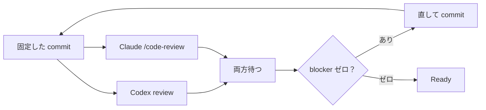

## これはなに？

7月のある夜、CI の設定ファイルを正規表現で守るガードを、Codex にレビューさせる自動ループに乗せました。実装エージェントが直し、Codex が再レビューし、また直す。人間は見ていません。22:25 から翌 0:11 まで、11コミット連続で「この書き方なら素通りします」が続きました。指摘は毎回、実証つきで正しかった。放っておいたら、正しい指摘のたびに正規表現が育っていって、コードが大変なことになるところでした。間違っていたのは設計と、止め方を決めていなかった私です。

その夜の正規表現の変遷と、翌週に決めた「レビューを終わらせる3つのルール」を書きます。Claude Code と Codex を並列でレビュアーにしている、ひとり開発の記録です。

## 何を守ろうとしたか

CI の変更範囲判定で、`.github/workflows/ci.yml` を「視覚回帰の対象外」に分類したかった。この yml は実行対象を選ぶだけで撮影結果に影響しないので、これを触るたびに 64 条件の視覚回帰を回すのは無駄だったからです。

ただし条件がある。ci.yml の中に「変更範囲判定のテストを実行する step」が残っている間だけ免除する。step を消した PR は免除されず、視覚回帰が要求される。これを ci.yml を文字列で読んで判定する関数にしました。

この時点で嫌な予感がした人は正しいです。

## 22:25 から翌 0:11 までに起きたこと

レビューは `codex review` をそのまま使い、指摘を実装エージェントが直してコミットし、同じコミットに再レビューをかける、を自動で回していました。以下は各コミットの時刻と、直前に Codex が指摘した内容、エージェントが直した正規表現です。

| 時刻 | Codex の指摘 | 直した形 |
|---|---|---|
| 22:25 | （初版） | `SELECTION_ONLY_VISUAL_INPUTS = ['.github/workflows/ci.yml', …]` の手書き列挙 |
| 22:32 | runner の列挙が手書き。増えたら漏れる | package.json から導出。ただし `command.includes('pnpm ' + runner)` の部分文字列一致 |
| 22:37 | 部分文字列は別の script 名に誤爆する | トークン一致 `(?:^\|[\s;&\|(])${key}(?=$\|[\s;&\|)'"])` |
| 22:54 | 素の vitest 呼び出しと composite action を見逃す | `uses: ./` の中身も追跡 |
| 23:00 | 引用符付き `uses:` を追跡しない | `/uses:\s*['"]?\.\/([^\s'"]+)/g` |
| 23:07 | ci.yml の免除が無条件 | ガード step が動いている間だけ免除 |
| 23:13 | ガード step の有無を文字列で見ている | job の step 構造を読む（下記） |
| 23:17 | `- if:` と第1キーに置くと 8 スペースの前提が外れる | `/(?:^\|\n)\s{8}if:/` → `/(?:^\|\n\s{8})if:/` |
| 23:20 | `continue-on-error` で失敗を握り潰せる | `run:` を完全一致にし、step の `continue-on-error:` を拒否 |
| 翌 0:06 | job レベルの `continue-on-error` は step 検査を素通り | job header を見る |
| 翌 0:11 | header 以外に置いても job レベルになる | job body 全体で検出。ここで打ち切り |

23:13 の時点の関数がこれです。

```js
export function runsScriptTests(workflow) {
  const job = workflow.match(
    new RegExp(`\\n  ${GUARDED_JOB}:\\n([\\s\\S]*?)(?=\\n  \\S|$)`),
  )
  if (!job) return false
  return job[1]
    .split(/\n      - /)
    .slice(1)
    .some(
      (step) =>
        new RegExp(`(?:^|\\n)\\s*run:[^\\n#]*${SCRIPT_TESTS_COMMAND}`).test(step) &&
        !/(?:^|\n)\s{8}if:/.test(step),
    )
}
```

4分後の 23:17 に、Codex が「`if:` を step の第1キーに置くと `- if:` になって 8 スペースの前提が外れる」と指摘してきました。直したのは1文字です。

```diff
-        ) && !/(?:^|\n)\s{8}if:/.test(step),
+        ) && !/(?:^|\n\s{8})if:/.test(step),
```

翌 0:11 の最終形。正規表現が6個入っています。人間がこの間に書いたものは1行もありません。

```js
export function runsScriptTests(workflow) {
  const job = workflow.match(
    new RegExp(`\\n  ${GUARDED_JOB}:\\n([\\s\\S]*?)(?=\\n  \\S|$)`),
  )
  if (!job) return false
  if (/(?:^|\n)\s{4}continue-on-error:/.test(job[1])) return false
  return job[1]
    .split(/\n      - /)
    .slice(1)
    .some((step) => {
      const run = step.match(/(?:^|\n\s{8})run:(.*)/)
      return (
        run?.[1].trim() === SCRIPT_TESTS_COMMAND &&
        !/(?:^|\n\s{8})if:/.test(step) &&
        !/(?:^|\n\s{8})continue-on-error:/.test(step)
      )
    })
}
```

ここで止めました。Codex はまだ `run` キーの重複、step の `shell:` 上書き、`working-directory:` 上書き、`defaults.run` による差し替えを挙げていました。どれも実際に素通りします。

## どれだけ育ったか

ガードに関わる4ファイル（判定本体、そのテスト、CI 契約のテスト、変更範囲の分類）を、各コミット時点で数えました。「素通りテスト」は、テストコードに列挙された「この書き方だと素通りする」パターンの数です。塞いだ穴を1つ固定するたびに、1件増えます。

| 時刻 | 正規表現の数 | 4ファイルの行数 | 素通りテスト |
|---|---|---|---|
| 着手前 | 53 | 536 | 0 |
| 22:25 | 53 | 627 | 0 |
| 22:54 | 57 | 746 | 0 |
| 23:13 | 60 | 872 | 7 |
| 23:20 | 61 | 885 | 12 |
| 翌 0:11 | 62 | 897 | 14 |

一晩で 361 行増えました。守りたかったのは「ガード step をうっかり消さないか」の1点で、そのために正規表現が9個、素通りパターンの列挙が14件。しかも PR 本文には、これに加えて「テストに落とさなかった素通り」が4種類書いてあります。

正規表現のパターンを1つ足すと、そのパターンが前提にしている書き方の数だけ穴が増える。テストの件数がそれをそのまま表していて、塞いだ数と穴の数が一緒に増えていく。だから終わらない。

## 指摘は毎回正しかった。では何が間違いか

塞ぐと、同じクラスの別の変種が出てくる。11コミットのうち7つが、この免除条件1点でした。

根っこは閉じない問題でした。書き換え可能な CI 設定が自分自身の検査を必ず実行することは、その設定の中からは静的に証明できない。YAML の書き換え方は無限にあって、文字列で読んでいる限り、正しい指摘も無限に来る。

間違いは2つありました。

1つ目は設計。yml を文字列で読ませたこと自体が間違いでした。job と step を構造として読んでいれば、`if:` のキー順や `continue-on-error` の階層で悩む必要はなかった。

2つ目は、止め方を決めていなかったこと。この免除が防ぎたかったのは「ガード step をうっかり消す」事故であって、commit 権限を持つ人が意図的に YAML を細工することではない。その線引きの材料はリポジトリの文書にすでに書いてありました。でも「レビュー指摘をどう分類するか」の規則の側には書いていなかった。だから指摘が来るたびにゼロから考えることになり、判断がつかず、翌 0:11 にようやく人間へ3択を出して聞きに来た。私が「現状で確定」と答えて、やっと止まりました。逆に言うと、エージェントが聞きに来なければ、まだ続いていた。

## 翌週に決めた3つのルール

この夜の記録から、レビューを「終わらせる」ための規則を3つ入れました。今も使っています。

**1. 守るのは事故だけ。** CI の設定を細工できるのは commit 権限を持つ人だけです。だから意図的な回避は防御対象の外だと文書に宣言する。指摘が来たら、まず「その指摘が成立するのに意図的な操作が要るか」を判定する。事故で起こり得るなら直す。意図的な操作が要るなら対象外として PR 本文に書いて進む。迷ったら事故側に倒す。

**2. 同じクラスが3巡続いたら打ち切る。** 同じ箇所で3巡し、各巡が同じクラスの新しい変種を出しているだけなら、そのクラスを現在の水準で閉じる。仕様書のレビューは、コマンド側が3ラウンド目で強制終了するようにしました。残った指摘は先送りとして次へ運ぶ。

**3. 2周目以降は差分だけ読む。** 毎回全差分を最大の深さで見せていたら、1つの PR で5時間の利用枠を使い切りました。2周目からの問いは「直したことで壊れていないか」であって「完璧か」ではないので、前回のレビュー以降に触った範囲だけを対象にする。

## 今のレビューの形

3つのルールを入れた後の形はこうです。Codex と Claude Code を同じコミットに並列でかけて、両方の指摘をまとめて分類する。



分類は3つだけです。

| 分類 | 基準 | 扱い |
|---|---|---|
| Blocker | 入力と状態を挙げて「こうすると壊れる」と言える | 直す。commit が変わるので両方やり直し |
| Follow-up | 良くなるだけ | 先送り。Ready 時に申告必須、merge 後に1件ずつ処分 |
| Non-actionable | 誤認、重複、好み、決定済みの蒸し返し | 対象外 |

通過条件は「両方に未解決の blocker がない」で、「指摘ゼロ」ではありません。2体にする理由は、探索の仕方が違うので見落とす場所も違うからで、片方だけの合格を最終ゲートにすると、もう片方にしか見つけられない blocker が残ります。実際、残りました。

先送りにした指摘は捨てさせません。Ready にするコマンドが先送りの申告を要求します。merge 後のコマンドは1件ごとに処分を要求します。処分は4種類。issue にする・規則や検査に昇格させる・結局直す・理由付きで捨てる。処分がないとコマンドが終わらない。記録は決定ではない、というのがこの夜の教訓の1つでした。

規則の全文は公開リポジトリの開発ワークフロー文書にあります。

https://github.com/artifactshare/artifactshare/blob/main/docs/development-workflow.md

## この話の全体像

この記事は、9月3日の ToKyoto.js #03 で話した「ひとりソフトウェアファクトリー」の一部です。人間はコードもレビュー結果も PR 本文も読まず、issue と PR のタイトルと CI の色だけを見て4ヶ月回した結果と、その仕組みの全体はスライドにまとめています。

https://artifactshare.com/a/8op3kvcy3x

正規表現でレビュアーと深夜にチキンレースをした話でした。
