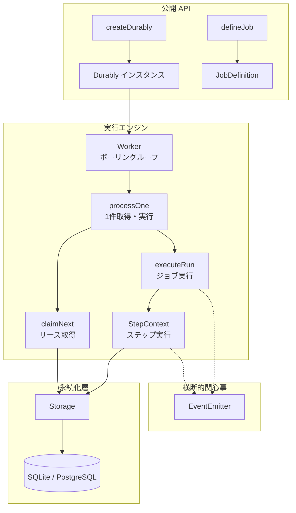
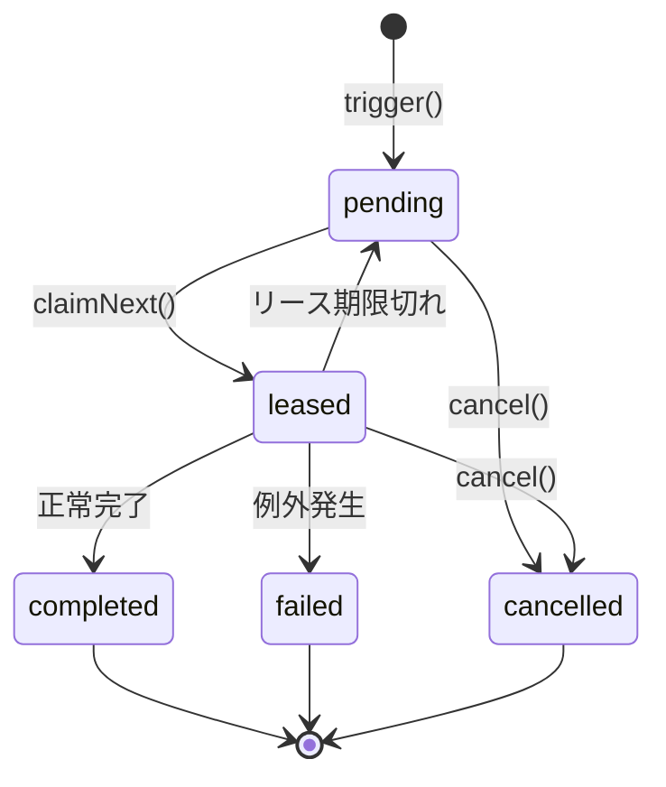
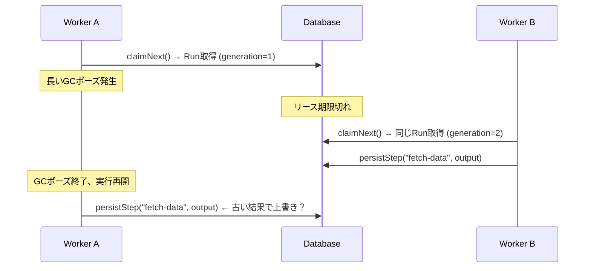
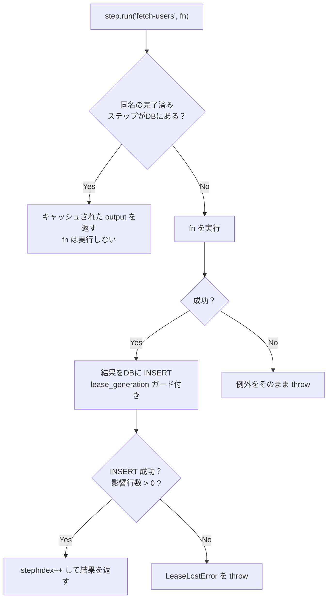
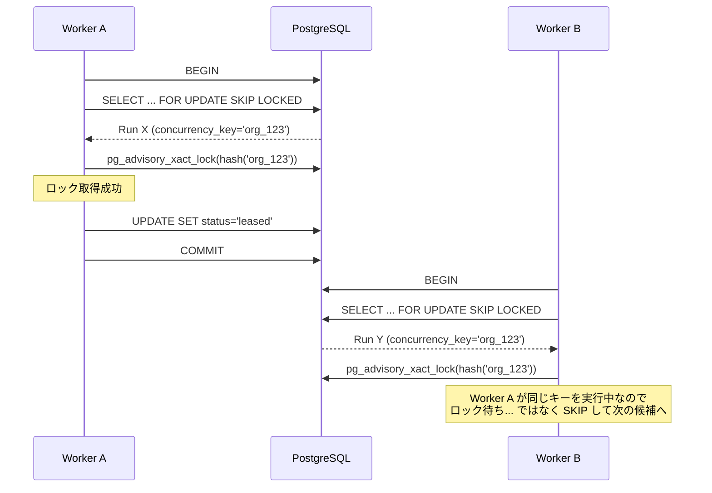
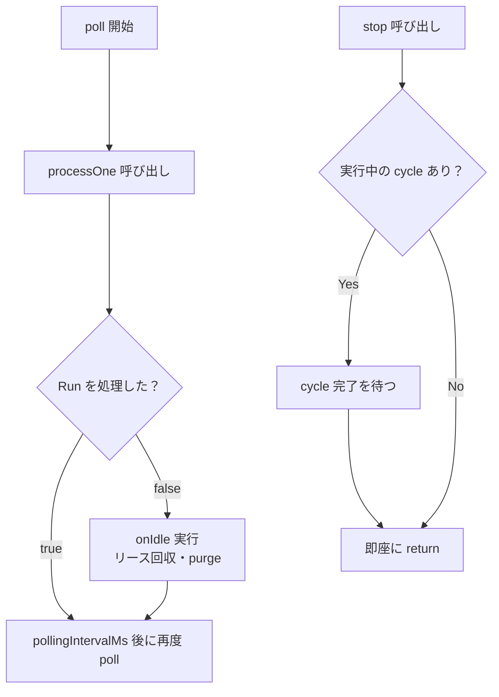

# これはなに？

自分がひとりで作っているアプリの、再開可能なバッチ処理基盤として Durably というフレームワークを作りました。LLM を使った数百件の翻訳・要約・分類タスクや、ちょっとしたファイルアップロード処理など、バックグラウンドで数分かかるような処理を安全に実行・再開するためのものです。Redis 不要で、SQLite か PostgreSQL だけで動きます。

https://coji.github.io/durably/

この記事では、そのコアパッケージ（`@coji/durably`）の内部構造を整理してみました。ジョブを「どう取り合い」「どう実行し」「どう再開するか」という問題に対して、リース・フェンシングトークン・ステップキャッシュという3つの仕組みがどう組み合わさっているかを見ていきます。

コードは GitHub で公開しているので、興味があれば実装と照らし合わせながら読んでみてください。

https://github.com/coji/durably

# 全体像

Durably のコアは約10ファイル、2000行程度のTypeScriptで構成されています。



モジュールの責務は明確に分かれています。`durably.ts` がインスタンスの生成とライフサイクル管理、`worker.ts` がポーリングループ、`context.ts` がステップ実行、`storage.ts` がデータベース操作を担います。この分離により、ワーカーはストレージの詳細を知らず、ステップ実行はポーリングの仕組みを知りません。

# Run のライフサイクル

Durably におけるジョブ実行の単位を Run と呼びます。Run は `trigger()` で作成され、ワーカーに拾われて実行され、完了または失敗で終わります。



ここで重要なのは `leased` という状態です。Run を実行するワーカーは、まずその Run のリース（一時的な所有権）を取得します。リースには有効期限があり、期限内に完了しなければ Run は `pending` に戻って別のワーカーが拾い直せます。これがプロセス障害からの自動復旧を可能にしています。

# リースとフェンシングトークン

リースの仕組みをもう少し掘り下げてみます。分散システムにおけるリースは「一定期間だけ有効なロック」として広く使われる手法ですが、Durably ではこれに加えてフェンシングトークンという仕組みを組み合わせています。

## なぜリースだけでは足りないか

次のシナリオを考えてみます。



Worker A がGCポーズなどでリース期限を過ぎても、プロセス自体は生きているので実行を続けてしまいます。Worker B が既に同じ Run を取得して処理を進めている中に、Worker A が古い結果を書き込むと状態が壊れてしまいます。

## フェンシングトークンによる解決

Durably は Run ごとにインクリメンタルなカウンタ `lease_generation` を持っています。Run がリースされるたびにこの値が1増えます。そしてワーカーがデータベースに書き込むすべての操作に、このカウンタをガードとして付与します。

```sql
-- ステップ結果の保存（実際のクエリを簡略化）
INSERT INTO durably_steps (run_id, name, output, ...)
SELECT $run_id, $name, $output, ...
WHERE EXISTS (
  SELECT 1 FROM durably_runs
  WHERE id = $run_id
    AND status = 'leased'
    AND lease_generation = $generation  -- フェンシングトークン
)
```

Worker A の `lease_generation` は 1 ですが、Worker B がリースを取得した時点で 2 に上がっています。Worker A の書き込みは WHERE 句にマッチしないため、影響行数が 0 になります。コードはこれを検知して `LeaseLostError` を投げ、自身のステップ実行を中止します。

ブロッキングロックではなく楽観的な検証なので、デッドロックが起きません。期限切れは単に次のリース取得で上書きされるだけです。

# ステップの再開可能性

Durably の中核機能であるステップの再開は、シンプルなキャッシュの仕組みで実現されています。

```typescript
const result = await step.run('fetch-users', async () => {
  return await api.fetchUsers(orgId)
})
```

`step.run()` は毎回次の手順で動きます。



ジョブ関数はプロセス再起動後にもう一度最初から呼び出されますが、既に完了したステップは `getCompletedStep()` でキャッシュヒットしてスキップされます。失敗したステップはキャッシュされないので、自然にリトライ対象になります。

ステップの一意性は `(run_id, name)` の部分ユニークインデックス（`WHERE status = 'completed'`）で保証されます。同じ名前のステップが二重に成功記録されることはありません。

この設計には1つの前提があります。ステップの実行順序と名前が決定的でなければならないということです。ジョブ関数を再実行したとき、ステップが前回と異なる順序や名前で呼ばれると、キャッシュが正しくヒットしません。これは Microsoft の Durable Functions や Temporal と同じ制約であり、ワークフローエンジンが決定的再実行に依存する設計では避けられないトレードオフです。

# SQLite と PostgreSQL の抽象化

Durably は単一のコードベースで SQLite と PostgreSQL の両方をサポートしています。Kysely の Dialect インジェクションによりクエリビルダは共通ですが、1箇所だけバックエンド固有のコードがあります。Run をリースする `claimNext` です。

## SQLite: アトミックな UPDATE サブクエリ

SQLite はデータベースレベルのロックを持たないため、単一のUPDATE文でアトミックにリースを取得します。

```sql
UPDATE durably_runs
SET status = 'leased',
    lease_owner = $workerId,
    lease_generation = lease_generation + 1,
    lease_expires_at = $expiresAt
WHERE id = (
  SELECT id FROM durably_runs
  WHERE (status = 'pending' OR (status = 'leased' AND lease_expires_at <= $now))
  ORDER BY created_at ASC
  LIMIT 1
)
RETURNING *
```

サブクエリで対象を1件選び、外側の UPDATE でリース情報を書き込みます。SQLite のシングルライターモデルにより、この操作は暗黙的にシリアライズされます。

ただし libSQL は内部的にトランザクションごとに別の接続を開くため、SQLite のシングルライター保証だけでは不十分な場合があります。そこで Durably はプロセスレベルの非同期ミューテックス（`withWriteLock`）ですべての書き込み操作を直列化しています。読み取りはミューテックスを経由しないため、パフォーマンスへの影響は小さくなっています。

## PostgreSQL: FOR UPDATE SKIP LOCKED とアドバイザリロック

PostgreSQL では行レベルロックを使った効率的な実装が可能です。

```sql
SELECT * FROM durably_runs
WHERE (status = 'pending' OR (status = 'leased' AND lease_expires_at <= $now))
ORDER BY created_at ASC
FOR UPDATE SKIP LOCKED
LIMIT 1
```

`FOR UPDATE SKIP LOCKED` は、他のトランザクションがロック中の行をスキップして次の候補を返します。複数ワーカーが同時にポーリングしても、互いにブロックせず異なる Run を取得できます。

concurrency key（同じキーの Run は同時に1つしか実行しない制約）がある場合は、PostgreSQL のアドバイザリロック `pg_advisory_xact_lock` でキー単位の排他制御を行います。



このように、データベースのネイティブ機能を活かしつつ、SQLite では代替的な手法で同等の保証を実現しています。

# ワーカーループの設計

ワーカーの実装は意図的にシンプルに保たれています。`worker.ts` は100行程度で、やっていることは「processOne を呼んで、結果に応じて次のアクションを決める」だけです。



`processOne()` は純粋に「1件取得して実行し、処理したかどうかを返す」関数です。メンテナンス処理（期限切れリースの回収、古い Run の自動削除）はワーカーがアイドル状態のとき、つまり `processOne()` が false を返したときだけ実行されます。

この分離には理由があります。以前はメンテナンス処理が `processOne()` の中に埋め込まれており、fire-and-forget で実行されていました。これは `processOne()` が false を返したとき（アイドル状態）でもバックグラウンドで非同期処理が動いているという矛盾を生んでいたんですが、メンテナンスをワーカーの `onIdle` コールバックに移すことで、`processOne()` の「false ならアイドル」という契約が正確に守られるようになりました。

`stop()` の実装も注目に値します。ワーカーは `processOne()` と `onIdle()` をひとつの Promise（IIFE）にまとめて `inFlight` として追跡しています。`stop()` はこの `inFlight` の完了を待ってから resolve するため、シャットダウン時にメンテナンス処理が中途半端に打ち切られることがありません。

# イベントシステム

Durably はイベント駆動の拡張ポイントを提供しています。Run やステップのライフサイクルの各段階でイベントが発火し、外部からの監視やリアルタイムUI更新に利用できます。

設計上の重要な判断として、イベントリスナーは同期的に呼び出されます。`emit()` はリスナーの戻り値を await しません。これはワーカーのホットパスにユーザーコードの遅延を持ち込まないための意図的な選択です。

ただし、TypeScript の型システムは `void` を返す関数に async 関数を渡すことを許容します。返された Promise は誰にも await されず、reject されてもエラーが握りつぶされてしまいます。Durably はこれに対処するため、リスナーの戻り値が thenable かどうかを実行時に検査し、もし Promise が返された場合は `.catch()` を付けて reject を `onError` ハンドラに転送します。await はしないので emit は同期のままですが、エラーが無言で消えることはなくなります。

```typescript
// emit() の内部（簡略化）
const result = listener(fullEvent)
if (result != null && typeof result.then === 'function') {
  result.catch(reportError)  // await はしない
}
```

# おわりに

Durably の内部構造を振り返ると、いくつかの設計原則が一貫して見えてきます。

まず、複雑な分散プリミティブを避けてデータベースの保証に頼るという方針です。リースの取得も、ステップの永続化も、冪等性の保証も、すべてデータベースのアトミックな操作に帰着させています。外部のキューやロックサービスは使いません。

次に、バックエンド間の差異を最小限に封じ込めるという方針です。`claimNext` だけがバックエンド固有で、それ以外のコードは SQLite でも PostgreSQL でも同じものが動きます。Kysely の Dialect インジェクションがこれを支えています。

そして、契約を正確に守るという方針です。`processOne()` が false を返したら本当にアイドルであること、フェンシングトークンが一致しなければ書き込みが無視されること、ステップの名前が同じなら同じ処理であること。これらの契約が、コード量の少なさに比して強い信頼性をもたらしています。

全体で2000行程度のコードベースなので、興味を持った方はぜひ直接読んでみてください。

https://github.com/coji/durably
