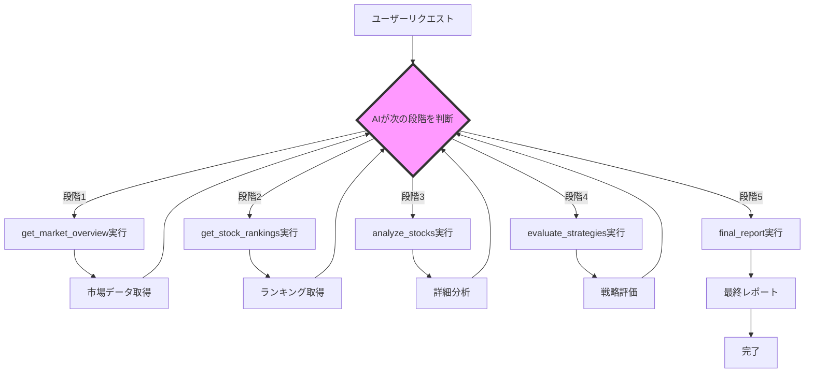

# はじめに

本記事では、React Router v7とVercel AI SDKを使った自律的なマルチステップAIエージェント「scalpingAgent」の実装について解説します。

**スキャルピング**とは、株の超短期トレードのことで、数分〜30分以内に取引を完了させるデイトレードのひとつです。今回のエージェントは、**スキャルピングで利益を上げられそうな銘柄とその要因を抽出する**ことを目的としています。

このシステムの最大の特徴は、**Vercel AI SDKのstreamTextとmaxSteps機能を活用し、AIがプロンプトに基づいて自分で考え、適切なツールを選択し、5段階の研究プロセスを自律的に実行する**点にあります。

## デモ動画

実際にscalpingAgentが動作している様子をご覧ください：

https://www.youtube.com/watch?v=SBVqcY67sus

## React Router v7 × Vercel AI SDK の統合

フロントエンドでは**React Router v7のResource Route（API Route）**とVercel AI SDKの**useChat**を組み合わせて実装しています：

```typescript
// フロントエンド（React Component）
import { useChat } from 'ai/react'

export default function ScalpingResearch() {
  const { messages, input, handleInputChange, handleSubmit, isLoading } = useChat({
    api: '/autonomous/api',  // Resource Route endpoint
  })
  
  return (
    <div>
      {messages.map(message => (
        <div key={message.id}>{message.content}</div>
      ))}
      <form onSubmit={handleSubmit}>
        <input value={input} onChange={handleInputChange} />
      </form>
    </div>
  )
}
```

```typescript
// Resource Route（API Route）
export const action = async ({ request }: Route.ActionArgs) => {
  const { messages } = (await request.json()) as { messages: UIMessage[] }
  
  const result = await runScalpingAgent(messages)
  
  return result.toDataStreamResponse()
}
```

この構成により、useChatが自動的にストリーミングレスポンスを処理し、AIの思考過程をリアルタイムで表示できます。

## 自律的マルチステップ実行の仕組み

### Vercel AI SDKのコア設定

```typescript
import { streamText } from 'ai'
import { google } from '@ai-sdk/google'

export async function runScalpingAgent(messages: Message[]) {
  return await streamText({
    model: google('gemini-2.5-flash'),
    tools,                    // カスタムツール群
    toolCallStreaming: true,  // ツール実行をストリーミング
    maxSteps: 20,            // ← ここがポイント！
    system: systemPrompt,
    messages,
  })
}
```

**Vercel AI SDKの`maxSteps: 20`** の設定により、AIは最大20回まで自律的にツールを実行できます。これが単純な1回限りのツール実行との大きな違いです。

### カスタムツールの定義

Vercel AI SDKの`createTool`を使用してカスタムツールを定義：

```typescript
import { createTool } from 'ai'
import { z } from 'zod'

const tools = {
  get_market_overview: createTool({
    description: '市場の概況を取得（日経平均、TOPIX、USD/JPY）',
    parameters: z.object({}),
    execute: async () => {
      // Yahoo Finance APIからデータ取得
    }
  }),
  
  get_stock_rankings: createTool({
    description: '株式ランキングを取得（値上がり率・出来高）',
    parameters: z.object({
      limit: z.number().default(20)
    }),
    execute: async ({ limit }) => {
      // ランキングデータ取得
    }
  }),
  
  // analyze_stocks, evaluate_strategies, final_report...
}
```

5つのツールをAIが状況に応じて選択・実行：

1. `get_market_overview` - 市場概況取得
2. `get_stock_rankings` - 銘柄ランキング取得
3. `analyze_stocks` - 複数銘柄の詳細分析
4. `evaluate_strategies` - 3つの戦略での評価
5. `final_report` - 最終レポート生成

## 実際のシステムプロンプト

```text
# 東証スキャルピング研究エージェント - 段階的分析システム

あなたは科学的手法を用いて段階的にスキャルピング機会を研究する専門エージェントです。
DeepResearchのように、仮説→検証→結論のサイクルを通じて最適解を発見します。

## 🔬 研究プロセス（5段階）

### 段階1: 市場環境分析
**目的**: 今日の市場の特徴を把握し、有効な戦略仮説を構築
**ツール**: 'get_market_overview'
**出力**: 日経平均、TOPIX、USD/JPYの価格と変動率データ
**仮説例**: "高ボラティリティ環境 → Livermore戦略が有効"

### 段階2: 候補銘柄の発見
**目的**: 仮説に基づき有望な銘柄を収集。最低20銘柄を抽出。
**ツール**: 'get_stock_rankings' (limit: 20)
**出力**: 値上がりランキングと出来高ランキングの構造化データ
**思考**: "どの条件の銘柄が今日の環境に適しているか？"
**データ処理**: ランキング結果から、value_upとvolumeの上位銘柄のcodeを抽出し、重複を除いて最大20銘柄のシンボル配列として段階3に渡すこと

### 段階3: 詳細分析・検証
**目的**: 候補銘柄の詳細な特性を分析
**ツール**: 'analyze_stocks' (段階2で抽出したシンボル配列を入力として使用)
**入力**: シンボル配列 例: ["6098", "3994", "7203", ...]
**出力**: 各銘柄の流動性・モメンタム・ボラティリティスコア、技術指標（SMA5/25/75）、トレンド判定
**検証**: "仮説通りの特性を持つか？技術指標は何を示している？予想と異なる点は？"

### 段階4: 戦略適用・評価
**目的**: 段階3の分析結果を受けて、3つの戦略で総合評価し比較
**ツール**: 'evaluate_strategies' (段階3の結果を入力として受け取る)
**入力**: 段階3のanalysisResults（rankings配列）
**出力**: 各銘柄の戦略別スコア、最適戦略、トレーディングプラン（エントリー/ターゲット/ストップロス価格）
**比較**: "どの戦略が最も適しているか？なぜそう判断するか？"

### 段階5: 最終レポート作成 ⚠️【必須実行】
**目的**: 段階1-4の全ての結果をまとめて最終レポートを作成
**ツール**: 'final_report'
**入力**: 
- researchSummary: 今回の研究で分かったことを要約
- executionRecommendations: 具体的な銘柄と取引プラン
- cautions: 注意事項とリスク警告
**出力**: 3セクション構成の最終レポート
**重要**: final_reportツール実行後は、重複した内容は抑え、ユーザに質問を促す形で終了してください。

## 🎯 3つのスキャルピング戦略

### Livermore戦略（勢い重視）
- **利幅**: 2.5-3.5% | **リスク**: 高 | **適用**: 強トレンド・高ボラティリティ
- **重視**: モメンタム50%, 流動性30%, ボラティリティ20%

### Niederhoffer戦略（統計重視）  
- **利幅**: 1.5% | **リスク**: 中 | **適用**: 安定環境・統計的優位性
- **重視**: モメンタム30%, 流動性50%, ボラティリティ20%

### Harris戦略（流動性重視）
- **利幅**: 0.8% | **リスク**: 低 | **適用**: 超高流動性・低ボラティリティ
- **重視**: モメンタム20%, 流動性60%, ボラティリティ20%

## 📋 研究原則
- 各段階で仮説→検証→結論のサイクルを実行
- データに基づく客観的判断、予想外の発見も報告
- 初心者向けの実行可能な推奨事項を提示
- 研究者として、データに基づく客観的分析と、実用的な推奨事項の両立を心がける

## ⚠️ 制約・注意事項
- データは遅延あり、市場時間外（前場9:00-11:30、後場12:30-15:30以外）は更新停止
- 個別銘柄取得失敗時は除外して続行、最低10銘柄確保
- 買いポジションのみ、30分以内取引、ストップロス必須

## 目標
30分以内に1-3%の利益を安全に狙える銘柄を発見し、初心者でも実行できる具体的な推奨事項を提示する。

## 実行方針
5段階の研究プロセスに従って体系的に進める：

**各段階で必須**：
- **仮説**: その段階で検証したい仮説を明確に述べる
- **思考過程**: なぜその判断・選択をしたかの理由を説明  
- **検証結果**: データから分かったことと予想との比較
- **次段階への示唆**: この結果が次の段階にどう影響するか
```

このプロンプトにより、AIは5段階のプロセスを自律的に実行し、各段階で仮説を立て、検証し、次段階への判断を行います。

## 実際の動作フロー



## 自律的実行の例

AIは以下のような判断を自律的に行います：

1. **市場分析後の判断**
   - 「日経平均が+2%上昇 → 高ボラティリティと判断 → Livermore戦略を重視」

2. **銘柄選択の判断**
   - 「値上がり率と出来高の両方にランクインした銘柄を優先」

3. **分析結果の解釈**
   - 「SMA5がSMA25を上抜け → 上昇トレンドと判断」

4. **戦略の選択**
   - 「高流動性・高モメンタムの銘柄 → Livermore戦略が最適」

## Vercel AI SDKの`maxSteps`が実現するマルチステップ実行

```typescript
maxSteps: 20  // Vercel AI SDKの強力な機能
```

### 従来のAIツール実行との違い

- **従来（maxSteps: 1）**：1つのツールを実行して終了
- **Vercel AI SDK（maxSteps: 20）**：AIが判断しながら複数のツールを連続実行

### Vercel AI SDKの利点

1. **ツールチェーン**：前のツールの結果を次のツールに自動的に渡す
2. **状態管理**：複数ステップ間での状態を自動管理
3. **エラーハンドリング**：個別ツールの失敗を適切に処理
4. **ストリーミング**：各ステップの進捗をリアルタイム表示

この設定により、AIは人間の介入なしに5段階すべてを完遂できます。

## 実装のポイント

### 1. ツール間のデータ連携

```typescript
// 段階2の出力
{
  symbols: ["6098", "3994", "7203", ...]  // シンボル配列
}

// 段階3はこの配列を入力として受け取る
{
  symbols: ["6098", "3994", "7203", ...]  // 前段階の出力を使用
}
```

### 2. プロンプトでの明確な指示

```text
**データ処理**: ランキング結果から、value_upとvolumeの上位銘柄のcodeを抽出し、
重複を除いて最大20銘柄のシンボル配列として段階3に渡すこと
```

### 3. エラーハンドリング

個別銘柄の取得に失敗しても、AIは判断して処理を継続：

```text
- 個別銘柄取得失敗時は除外して続行、最低10銘柄確保
```

## まとめ

scalpingAgentの成功の鍵は、**Vercel AI SDKの強力な機能**を活用した点にあります：

### Vercel AI SDKの活用ポイント

1. **`maxSteps: 20`** による自律的なマルチステップ実行
2. **`createTool`** によるZodスキーマベースのツール定義
3. **`toolCallStreaming`** による進捗のリアルタイム表示
4. **`streamText`** による高速なレスポンス

### 実装の核心

1. **詳細なプロンプト** による段階的実行の指示
2. **ツール設計** による段階間のスムーズなデータ連携
3. **エラーハンドリング** による堅牢な処理

これにより、AIエージェントが人間のアナリストのように、仮説を立て、データを収集し、分析し、結論を導くプロセスを自律的に実行できます。

**Vercel AI SDKは、複雑なマルチステップAIワークフローを簡単に実装できる優れたツール**であり、この設計パターンは他の分析タスクにも応用可能です。

## 参考リンク

- [Vercel AI SDK](https://sdk.vercel.ai/)
- [Google AI SDK](https://ai.google.dev/)
- [Yahoo Finance API](https://finance.yahoo.com/)
