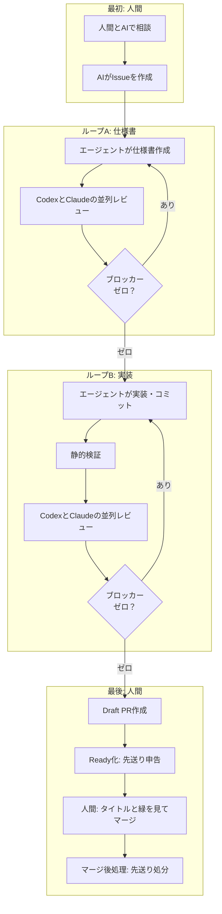

## これはなに？

HTMLを社内だけで安全に共有するWebサービス「Artifact Share」を、ひとりで開発しています。TypeScriptで書かれたWebアプリケーションです。

開発を始めて4ヶ月が経ちました。リポジトリのTypeScriptコードは25万行を超え、マージしたPRは1,144本、Issueは777件に達しています。開発している人間は、ぼく1人です。

25万行ものコードを通読するのは、早々に諦めました。

コードは読みません。差分も見ません。

普段ぼくが見ているのは、AIと壁打ちして作ったIssueと、PRのタイトル、そしてCIが成功して緑色になっているかどうかの3点だけです。コード本体も、AI同士のレビュー結果も、PRの本文すら普段は読んでいません。

「そんな無茶なやり方で、本当にサービスが動くのか？」

最初はぼくも半信半疑でした。

実際、一般公開後の4週間で233本のPRをマージしました。差し戻し（revert）はゼロ本。本番環境で発生した不具合は9件でした。

本業のクライアントワークへ注意力を残しながら、個人開発を破綻させずに回すにはどうすればいいのか。4ヶ月間の試行錯誤の末にたどり着いた、コードを読まずに回す自動化工場の仕組みをまとめてみました。

サービスの実物とリポジトリ、登壇スライドはこちらです。

- サービス: https://artifactshare.com/ja
- リポジトリ: https://github.com/artifactshare/artifactshare
- 登壇スライド: https://artifactshare.com/a/8op3kvcy3x

## コードを読まなかった結果：月9件の不具合をどう受け止めるか

仕組みの話に入る前に、コードを読まなかった現実の結果からお話しします。

公開後の4週間で233本のPRをマージし、本番で起きた不具合は9件でした。CodexとClaude Codeによる二重レビューを通していますが、不具合は普通に出ます。防ぎきれません。

実際に起きたトラブルは、こんな内容でした。

組織ドメインのワークスペースが二重に作られて社内共有のファイルが見えなくなったり、Windows環境でCLIログインが失敗したり。日次のデータ掃除バッチが、ユーザーのアバター画像まで毎日消してしまうトラブルもありました。

ひどいときには、同じ日に3件の不具合が重なって冷や汗をかきました。どれだけAIを手厚く並べて二重チェックさせても、すり抜ける穴はどうしても残ります。

それでも、月に9件の不具合は「人間がコードを読まないための必要経費」として受け入れています。

事故が起きたときにすぐ戻せる巻き戻し手順と、同じ穴を二度と開けないための自動検査を配置しておく。これで致命傷を防ぎ、安全を担保しています。

## 今の流れ：人間が関わるのは「最初」と「最後」だけ

現在の開発パイプラインでは、1本のIssueを立ててから本番へマージするまで、人間が関わる場所を2箇所だけに絞っています。



人間が関わるのは、最初と最後だけです。

最初に関わるのは、人間がAIと壁打ちしてIssueを書かせる工程です。何を作るのか、どこまでをやって何をやらないのか、どうなったら完成なのかという受け入れ条件を言葉で詰めます。

最後は、できあがったPRのタイトルとCIの緑色を確認して、マージボタンを押す工程です。

その間にある仕様書づくりと実装は、完全にAIエージェントの自律ループに任せています。

### ループA：仕様書ループ

まずエージェントが仕様書をMarkdownで書き、自社サービス（Artifact Share）のURLへアップロードします。版ごとに固有のIDが付くため、レビューを頼むAIにも対象の版を確実に固定して渡せます。

仕様書の冒頭には、必ず「Scope lock」という節を作らせるようにしました。Issueで合意した目的、やらないこと、受け入れ条件の3つを冒頭に固定する枠組みです。AIは議論が長引くにつれて、最初の前提を忘れて勝手に機能を盛り盛りにしがちです。Scope lockを書いておくことで、前提がブレないように錨を下ろしています。

仕様書ができたら、CodexとClaude Codeを並列で走らせて同時にレビューさせます。どちらか一方からでも致命的な問題（ブロッカー）が指摘されたら、仕様書を直して版を更新し、もう一度両方にレビューを投げます。両方のブロッカーがゼロになったら、次の実装工程へ進みます。

### ループB：実装ループ

仕様書が固まったら、エージェントがコードを書いてコミットを作ります。

ここでは、CIと同じ静的解析（型チェックやリント、テスト）をローカルで走らせて検証します。エラーが出なくなったら、その固定したコミットに対して、ふたたびCodexとClaude Codeを並列で走らせてコードレビューを行います。

通過条件は仕様書のときと同じで、「両方のエージェントで未解決のブロッカーがないこと」です。ブロッカーがゼロになるまで差分の修正と再レビューを繰り返し、クリアできたらDraft PRを作ります。

## AIのレビューを終わらせるための工夫

AIにコードレビューを頼むと、放っておけばいつまでも指摘を出し続けてしまいます。「もっと綺麗に書ける」「このエッジケースも考慮すべきだ」と、何十周でも止まりません。

レビューを有限回で気持ちよく終わらせるために、3つのルールを決めました。

### 1. 通過条件を「ブロッカーなし」にする

レビューの合格ラインは、「未解決のブロッカーがないこと」だけに絞りました。すべての指摘をゼロにすることまでは求めません。

指摘は3種類に分類して扱っています。

まずは、具体的な入力や状態を挙げて「こう動かすと壊れる」と実害を説明できるブロッカー（Blocker）です。これはその場で直します。コミットが変わるので、両方のAIでチェックをやり直します。

次は、直せば品質は上がるものの、今回の目的には直結しない先送り（Follow-up）です。これは後回しリストに逃がします。

最後は、AIの勘違いや好みの問題、すでに合意した決定事項の蒸し返しといった対応不要（Non-actionable）なコメントです。理由を一言添えて無視します。

その場で直すのはブロッカーだけです。良くなる程度の提案はすべて先送りに回すことで、レビューがいつまでも終わらない事態を防いでいます。

### 2. 防ぐ対象を「うっかり事故」に絞り込む

ガードレールや検査スクリプトを作るとき、防ぐ対象を「悪意ある攻撃」ではなく「人間のうっかりミス」に絞りました。

コミット権限を持つ人間が、悪意を持って裏道を仕込んだり、正規表現をかいくぐる細工をしたりするケースは最初から防ぐ対象外にしています。人間が作業手順をうっかり飛ばしてしまったり、引数を取り違えたりする事故だけを防げれば十分です。

悪意ある回避経路まで正規表現で塞ごうとすると、Codexが「このパターンなら突破できる」と無限に変種を思いついて指摘してきて、レビューが永遠に終わりません。防ぐ対象を事故と割り切ったことで、過剰な指摘をブロッカーから外せるようになりました。

### 3. 2周目以降は差分だけを読ませる

1回目のレビューでブロッカーが見つかり、修正して2周目のレビューに回すときは、直前のコミットからの変更差分だけを渡すようにしました。

レビューで問いかけるのは、「直したことで別の場所が壊れていないか」という1点だけです。全体の完成度を毎回採点させてはいけません。コミット全体を見せ続けていると、AIは別の場所に新しいツッコミどころを見つけてしまい、あっという間に無限ループに入ります。実際に1つのPRで5時間枠を溶かしてしまった苦い反省から、差分だけの再レビューに切り替えました。

また、仕様書レビューには「最大3周まで」という上限を設けました。3周してもブロッカーが解消しない場合はコマンドが自動で終了し、残りの論点を先送りに回して人間に判断を戻すようにしています。

## 先送りした負債を放置しない仕組み

良くなるだけの改善案を先送りに逃がせるようにすると、今度は技術的負債が溜まりやすくなります。人間もAIも、後回しにしたタスクは放置してしまいがちです。

そこで、先送りしたタスクを必ず棚卸しさせる仕組みをCLIコマンドに組み込みました。

まず、PRをDraftからレビュー完了（Ready）に切り替えるコマンドでは、先送りした指摘の全件申告を必須にしています。申告が空のままだと、コマンドが弾かれてReadyになりません。

```bash
pnpm pr:ready --deferred "型定義の共通化は別PRへ切り出し"
```

さらに、マージ後に実行する後処理コマンドでは、先送りした課題ごとにどう処分するかを1件ずつ選ばせます。

新しいGitHub Issueを起票して番号を紐付けるのか、リポジトリの共通ルールや自動検査スクリプトに格上げするのか。あるいはその場でサッと直したのか、今回は対応不要と判断して理由を記録して捨てるのか。

すべての先送りに対して処分を確定させないと、マージ後処理のコマンドが完了しません。「とりあえずメモしたから安心」で終わらせず、強制的にIssueにするか捨てるかを決めさせる設計にしています。

## GitHub Actionsの課金で赤字になり、コードを公開した

この自動化ループが気持ちよく回るようになって開発速度が上がった反面、7月に別の問題へ突き当たりました。GitHub Actionsの実行時間が急増したのです。

非公開リポジトリで回していたActionsの実行時間が、直近30日で200時間を超えてしまいました。無料枠はあっという間に使い切り、月額1万円以上の請求が発生するようになったのです。個人開発のサイドプロジェクトはお金も時間も持ち出しゼロで回すのがぼくの基本方針なので、これは見過ごせませんでした。

最初は自宅PCにSelf-hosted runnerを立てて費用を抑えようと考えました。しかし、外部からのPRや依存パッケージを安全に隔離するための仕組みを見積もってみたところ、安全装置のスクリプトだけで1万行規模に膨らみそうだとわかりました。ひとりで保守していく現実味がありません。

そこで思い直しました。GitHubは、公開リポジトリであればActionsを無料で利用できます。

「それなら、コードを公開してしまえばいいのでは？」

そう考えてリポジトリをオープンソース化し、開発の現場をパブリックリポジトリへ引っ越しました。CIの課金を止めるための現実的な選択でした。

もちろん、パブリックにする以上、顧客情報や社内Issue番号がコミットに混ざってはいけません。そのため、Gitでプッシュする前に機密文字列が含まれていないかを機械的に走査する境界ガードを導入しています。

## 7,200行あった自動化設備を捨てて、37行に戻した顛末

この4ヶ月間、AIエージェントを思い通りに制御するために、たくさんの仕組みを作っては捨ててきました。

エージェントに毎回読ませるワークフロー規則の行数は、次のように激しく移り変わりました。

5月の時点では181行でした。日本語の散文で指示を書いていた時期です。

それが7月には644行まで膨らみました。ルール破りが起きるたびに追加の指示と検査スクリプトを足していった結果、検査コードだけで約7,200行に達してしまったのです。

最初は「日本語の文章はこういうトーンで書くこと」「ここで作業を止めて人間に確認すること」といった指示を、自然言語で丁寧に書いていました。ですが、エージェントは文脈が長くなると、こうした指示を実にあっさりと読み飛ばしてしまいます。

守らせるために検査スクリプトを追加していった結果、8月のある日、ふと我に返りました。

「レビューの準備やゲートの運用自体が、実装とレビューそのものより重くなっていないか？」

本末転倒だと気づき、作りすぎた検査スクリプトやログ採取の仕組みを一気に捨てました。その結果、エージェントに読ませるワークフロー規則は、わずか37行に落ち着きました。

## 最終的に残った3つの仕組み

4ヶ月間の試行錯誤の末に、手元に残った本当に必要な仕組みは次の3つだけでした。

1つ目は、固定したコミットに対する並列二重レビューです。CodexとClaude Codeを同時に走らせ、未解決のブロッカーがゼロになるまでマージへ進めません。

2つ目は、事故だけを防ぐ機械検査です。CIと同じ静的解析をローカルで流し、悪意の細工ではなくうっかりミスだけを拾います。

3つ目は、先送りタスクの処分を強制するCLIコマンドです。マージ前後に処置を要求し、技術的負債をうやむやに放置させません。

現在運用している開発ワークフローの規則全文は、GitHubで公開しています。37行の簡潔なドキュメントなので、気になった方は覗いてみてください。

https://github.com/artifactshare/artifactshare/blob/main/docs/development-workflow.md

## コードを読まない開発で、人間がやるべきこと

「コードを読まない開発において、人間は何を確認すれば足りるのか？」

この問いに対するぼくの答えはシンプルでした。

最初のIssueをAIと相談して丁寧に書くこと。そして、最後のPRタイトルとCIの緑を確認してマージすること。この2つだけです。

その間にある泥臭い工程は、3つのシンプルな仕組みで手綱を握ったAIたちに任せてしまえば安全に回ります。

開発のボトルネックは、コードの生成速度でも読む速度でもなく、人間の注意力でした。日中はクライアントワークでしっかり頭を使いたいからこそ、個人開発では注意力をすり減らさない自動化工場が必要だったのです。

ひとりでも、工夫次第で立派な工場になります。
