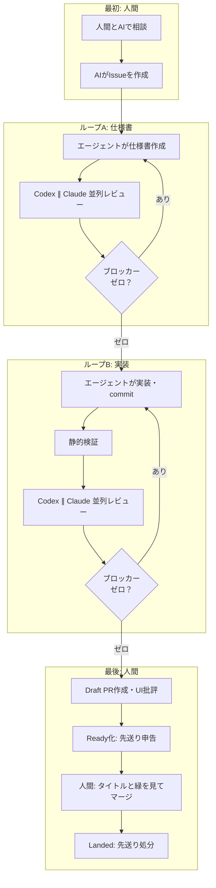

## これはなに？

HTMLを社内だけで共有するサービスを、ひとりで開発しています。TypeScriptで書かれたWebアプリケーションです。

4ヶ月でTypeScriptが25万行、PRが1,144本、Issueが777件になりました。人間は自分1人です。

25万行のコードを通読するのは諦めました。読んでいるのは、AIと相談して書かせたIssue、PRのタイトル、CIが緑かどうかの3点だけです。コード本体も、レビュー結果も、PRの本文も読んでいません。

公開後の4週間でマージしたPRは233本、revertはゼロ、本番に出た不具合は9件でした。

本業のクライアントワークへ注意力を残すため、人間がコードを読まず安全に回る工場を作りました。試行錯誤の末に残った運用の全体像を書きます。

## 読まなかった結果

仕組みを説明する前に、コードを読まなかった結果をまず示します。

4週間で233本のPRをマージし、本番に出た不具合は9件でした。二重レビューを通しても、不具合は出ます。

```
マージした PR: 233本（revert 0本）
本番に出た不具合: 9件
先送りを抱えたままマージした PR: 11本
```

出た不具合は次のようなものです。

- 組織ドメインのワークスペースが二重化して社内共有が見えなくなる
- Windows環境でCLIのログインが必ず失敗する
- 日次のデータ掃除処理がアバター画像を毎日消してしまう

うち3件は同じ日に発生しました。二重レビューをすり抜ける穴は必ずあります。

月に9件の不具合は、人間がコードを読まないための対価として受け入れています。事故が起きたときに戻せる体制と、同じ穴を二度開けない検査の配置で担保しています。

## 今の1本の流れ：人間は最初と最後だけ

現在の開発パイプラインでは、1本のIssueからマージまで、人間が関わる場所を2箇所だけに絞っています。



人間が関わるのは最初と最後だけです。

最初は、人間がAIと壁打ちしてIssueを書かせる工程です。ここで目的、受け入れ条件、やらないことを決めます。

最後は、PRのタイトルとCIが緑かどうかを見てマージボタンを押す工程です。

その間には、ゲート付きのループが2つ回ります。仕様書を作るループAと、実装するループBです。

### ループA：仕様書ループ

エージェントが仕様書を書き、自社サービスのURLへ配置します。版ごとに固有のIDが付くため、同じ版を固定してレビューへ渡せます。

仕様書の冒頭には必ず「Scope lock」節を書かせます。Issueで決めたこと、やらないこと、受け入れ条件の3点です。AIは議論が長引くと、最初の前提を忘れて要件を膨らませがちです。Scope lockはその記憶を固定する錨になります。

レビューはCodexとClaude Codeを並列で実行します。ブロッカーが1件でもあれば仕様書を直して版を更新し、両方のレビューをやり直します。ブロッカーがゼロになれば実装へ進みます。

### ループB：実装ループ

エージェントがコードを書き、コミットを作ります。

検証では、CIと同じ静的解析を必ず実行します。そのうえで、固定したコミットに対してCodexとClaude Codeを再び並列で走らせます。

通過条件は「両方に未解決のブロッカーがないこと」です。良くなるだけの指摘は先送りに回し、ブロッカーがゼロになるまで差分だけを直して再レビューを回します。

## ループを終わらせるための設計

AIにレビューを任せると、放っておけばいつまでも指摘を出し続けます。レビューを有限回で終わらせるため、3つの規則を決めました。

### 1. 通過条件は「ブロッカーなし」

通過条件は「未解決のブロッカーがないこと」です。指摘ゼロまでは求めません。

指摘は3種類に分類します。

| 分類 | 判定基準 | 処置 |
|---|---|---|
| Blocker | 入力と状態を挙げて「こう壊れる」と言える指摘 | 直す。コミットが変わるので両方やり直し |
| Follow-up | 直せば良くなるが、今回の成立条件ではない指摘 | 先送りに積む |
| Non-actionable | 誤認、重複、好み、決定事項の蒸し返し | 理由を添えて無視する |

ブロッカーだけを直します。良くなるだけの指摘はすべて先送りに回します。

### 2. 守るのは事故だけ

検査やガードを書くとき、防ぐ対象を「事故」に絞りました。

コミット権限を持つ人間が意図的に仕込む不正な記法や回避工作は、防御の対象外とします。人間がうっかり step を消してしまったり、引数を取り違えたりする事故だけを防ぎます。

悪意ある攻撃の回避経路まで正規表現で塞ごうとすると、Codexから無限に変種を指摘されてレビューが終わりません。防ぐ対象を事故と定義したことで、重箱の隅をつつく指摘をブロッカーから外せるようになりました。

### 3. 2周目以降は差分だけを読む

2周目以降のレビューでは、直前のレビュー対象からの変更差分だけを渡します。

問いは「直したことで別の場所が壊れていないか」の1点です。全体の完璧さは求めません。毎回コミット全体を見せていると、別の場所に新しい論点を見つけて無限ループに入ります。実際に1つのPRで5時間枠を使い切った反省から、差分のみの再レビューに切り替えました。

また、仕様書レビューには3周の打ち切り上限を設けました。3周してもブロッカーが解消しない場合はコマンドが強制終了し、残余を先送りに回して人間へ判断を戻します。

## 先送りを捨てさせない仕組み

良くなるだけの指摘を先送り（Follow-up）に逃がすと、今度は技術的負債が放置されがちになります。そこで、先送りの処分をコマンドで強制する仕組みを作りました。

PRを準備完了（Ready）にするコマンドは、先送りした指摘の全件申告を求めます。申告が空のままではReadyになりません。

```bash
pnpm pr:ready --deferred "型定義の共通化は別PRへ切り出し"
```

さらに、マージ後に実行するコマンドは、先送りした指摘ごとに処分を要求します。

- **issue**: 新しいIssueを起票して番号を記録する
- **promoted**: 検査スクリプトやリポジトリの規則に昇格させる
- **fixed**: 直した
- **dropped**: 今回は対応不要と判断し、理由を添えて捨てる

処分を確定させないと、マージ後処理のコマンドが完了しません。記録しただけで対応した気配になるのを防ぎ、負債を棚卸しする設計にしています。

## CI代で赤字になり、ソースを公開した

ループが自動で回るようになると、今度はGitHub Actionsの実行時間が急増しました。

7月、非公開リポジトリでのActions実行時間が直近30日で200時間を超えました。無料枠を使い切り、月額1万円以上の請求が発生するようになりました。サイドプロジェクトはお金と時間の持ち出しゼロが前提です。

最初は自宅PCにrunnerを立てて費用を抑えようとしました。しかし、外部からのPRを隔離する安全装置の見積もりが1万行規模に膨らむ見込みとなり、ひとりで保守する現実味がありませんでした。

一方、GitHubは公開リポジトリであればActionsを無料で利用できます。そこでソースコードを公開し、開発の現場をパブリックリポジトリへ移しました。CIの課金を止めるための現実的な選択でした。

公開に伴い、顧客情報や社内Issue番号がコミットに混ざらないよう、プッシュ前に機械的に文字列を検査する境界ガードを導入しています。

## 7,200行の設備を捨てて37行に戻した

この4ヶ月間、エージェントを制御するための設備を作っては捨てる作業を繰り返してきました。

エージェントに毎回読ませるワークフロー規則の行数は、次のように推移しました。

```
5月: 181行（自然言語の散文）
7月: 644行（破られるたびにルールと検査を追加、検査スクリプト7,200行）
8月:  37行（設備を破棄し、必要最小限に整理）
```

最初は「日本語の文章はこう書け」「ここで作業を止めろ」といった自然言語の指示を書いていました。しかしエージェントは指示を容易に読み飛ばします。

守らせるために検査スクリプトを追加していった結果、7月にはワークフロー関連のコードだけで約7,200行に達しました。

8月に「レビューの準備とゲートの運用自体が、実装とレビューそのものより重くなっている」と判断しました。作りすぎた検査やログ採取スクリプトをすべて捨て、ワークフロー規則は37行に落ち着きました。

## 残ったのは3つ

試行錯誤の末に、現在の手順に残った仕組みは3つだけです。

1. **固定した1版への並列二重レビュー**: CodexとClaude Codeを走らせ、ブロッカーなしで通す
2. **事故だけを防ぐ機械検査**: CIと同じ静的解析をローカルでも流し、意図的な細工は守らない
3. **先送りの処分の強制**: マージ前後にコマンドで処置を要求し、負債を放置しない

現在運用している開発ワークフローの規則全文は、公開リポジトリに置いています。

https://github.com/artifactshare/artifactshare/blob/main/docs/development-workflow.md

最初の問いに戻ります。コードを読まない開発において、人間は何を確認すれば足りるのか。

自分の答えは、「最初のIssueを相談して書くこと」と、「最後のPRタイトルとCIの緑を見ること」の2つでした。その間の工程は、3つの仕組みで縛ったAIに任せています。

ボトルネックは人間の注意力でした。コードの生成速度ではありません。本業の仕事に注意力を残すために、この工場を作りました。

ひとりでも、工場になります。

---

スライドの実物は、以下で公開しています。

https://artifactshare.com/a/8op3kvcy3x
