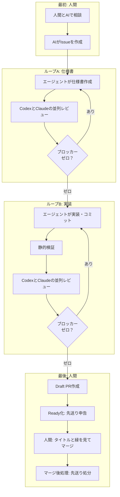

## これはなに？

この記事は、「コードを読まなくても大丈夫」という話ではありません。コードを読まないと決めたぼくが、何につまずき、どんな仕組みを足し、何を作りすぎて捨てたのか。その試行錯誤から残った、仕様と実装のレビューループの話です。

HTMLを社内だけで安全に共有するWebサービス「Artifact Share」を、ひとりで開発しています。TypeScriptで書かれたWebアプリケーションです。

開発を始めて4ヶ月が経ちました。リポジトリのTypeScriptコードは25万行を超え、マージしたPRは1,144本、Issueは777件に達しています。関わっている人間は、ぼく1人。

25万行ものコードを通読するのは、早々に諦めました。コードは読みませんし、差分も見ません。

普段ぼくが見ているのは、AIと壁打ちして作ったIssueと、PRのタイトル、そしてCIが成功して緑色になっているかどうかの3点だけです。コード本体も、AI同士のレビュー結果も、PRの本文すら普段は読んでいません。

「趣味のおもちゃだからできるのでは？」と思われるかもしれません。

実は、Artifact Shareは7月から有料課金を始めています。ぼくのクライアント企業1社、カリフォルニアの企業1社、そして個人の方が1人、サブスクリプションで課金してくださっています。無料利用を含めたワークスペース（企業・個人）の数は133に達し、先週だけでも50人の方がこのサービスでHTMLを共有していました。継続して使っていただいているため、いまは絶対に止められない本番サービスです。

直近4週間の実績で言うと、マージしたPRは233本で、差し戻し（revert）はゼロ本でした。全停止するようなサービスダウンも、これまで一度も起きていません。

本番サービスを抱えながら、コードを読まない運用のままでなぜ破綻せずに回せているのか。試行錯誤の末に残った自動運用の全体像をまとめてみました。

先週9月3日の勉強会「ToKyoto.js #03」で登壇した際のスライドはこちらです。

https://artifactshare.com/a/8op3kvcy3x

サービスの実物と公開リポジトリも置いておきます。

- サービス: https://artifactshare.com/ja
- リポジトリ: https://github.com/artifactshare/artifactshare

## 立ち上げ期のノーガード運転：事故が起きてからガードレールを作る

この開発を始めた5月当初、ひとつの極端な方針を決めました。「可能な限りすべてをAIに任せて、自分はコードを一切読まない」ということです。

事前のガードレールは何も用意しませんでした。「こう動いてほしい」「こういうミスをするかもしれない」と人間が先回りして細かくルールを作ることはやめました。

やったことは、高速な自動運転車をノーガードの道路で走らせるような作業です。

まずAIに車を走らせてみる。壁にぶつかったりコースアウトしたりしたら、その都度Issueを立てて、「こういう事故が起きたから対策を考えてくれ」とAI自身に相談する。AIに対策のガードレールを作らせ、ループが回るようにコードを直させて、また走らせ直す。

この繰り返しで開発を進めてきました。

当然ですが、このやり方は5月の立ち上げ期に「自分だけが使うサービス」としてゼロベースで始めたからこそ取れたアプローチです。最初から利用者がいるサービスや、何十人もの開発メンバーがいるチームの現場で「ノーガードで走らせよう」なんて言ったら怒られますし、やってはいけません。

この立ち上げ期に事故を恐れずに走らせ、事故が起きるたびにガードレールを作り直してきたからこそ、有料ユーザーを抱える今になってもサービスダウンを起こさずに済んでいます。

それでも、二重レビューをすり抜ける穴は残ります。公開後の4週間でも、本番で9件の不具合が出ました。

組織ドメインのワークスペースが二重に作られて社内共有のファイルが見えなくなる。
Windows環境でCLIからログインしようとすると、ファイルパスの扱いの違いで失敗する。
日次のデータ掃除バッチが、ユーザーのアバター画像まで毎日消してしまう。

ひどいときには、同じ日に3件の不具合が重なって冷や汗をかきました。

二重レビューを通しても、不具合をゼロにはできません。それでも致命傷にならずに回せているのは、事故が起きたときにすぐ戻せる巻き戻し手順と、同じ穴を二度と開けないための自動検査をその都度配置してきたからです。

## 芯として残った仕組み：仕様と実装の二重レビューループ

試行錯誤を重ねる中で、エージェントを縛るための仕組みを作りすぎて破綻しかけた時期もありました。そうした余分な設備を削ぎ落とした末に残ったのが、現在の手順です。

人間が関わる場所を「最初」と「最後」の2箇所だけに絞り、真ん中に2つのループを配置しています。



人間が関わるのは、最初と最後だけです。

最初に関わるのは、人間がAIと壁打ちしてIssueを書かせる工程です。何を作るのか、どこまでをやって何をやらないのか、どうなったら完成なのかという受け入れ条件を言葉で詰めます。

最後は、できあがったPRのタイトルとCIの緑色を確認して、マージボタンを押す工程です。

その間にある2つのループが、開発の屋台骨になっています。

### ループA：仕様書ループ

まずエージェントが仕様書をMarkdownで書き、自社サービス（Artifact Share）へアップロードします。版ごとに固有のURLが発行されるため、レビューするAIに対象の版を確実に固定して渡せます。

仕様書の冒頭には、必ず「Scope lock」という節を作らせるようにしました。Issueで合意した目的、やらないこと、受け入れ条件の3つを冒頭に固定する枠組みです。AIは議論が長引くにつれて、最初の前提を忘れて勝手に機能を盛り盛りにしがちです。Scope lockを書いておくことで、前提がブレないように錨を下ろしています。

仕様書ができたら、CodexとClaude Codeを並列で走らせて同時にレビューさせます。どちらか一方からでも致命的な問題（ブロッカー）が指摘されたら、仕様書を直して版を更新し、もう一度両方にレビューを投げます。両方のブロッカーがゼロになったら、次の実装工程へ進みます。

### ループB：実装ループ

仕様書が固まったら、エージェントがコードを書いてコミットを作ります。

ここでは、CIと同じ静的解析（型チェックやリント、テスト）をローカルで走らせて検証します。エラーが出なくなったら、その固定したコミットに対してふたたびCodexとClaude Codeを並列で走らせてコードレビューを行います。

通過条件は仕様書のときと同じで、「両方のエージェントで未解決のブロッカーがないこと」です。ブロッカーがゼロになるまで差分の修正と再レビューを繰り返し、クリアできたらDraft PRを作ります。

## AIのレビューを終わらせるための3つの工夫

AIにコードレビューを頼むと、放っておけばいつまでも重箱の隅をつついて指摘を出し続けてしまいます。レビューを有限回で気持ちよく終わらせるために、3つのルールを決めました。

### 1. 通過条件を「ブロッカーなし」にする

レビューの合格ラインは、「未解決のブロッカーがないこと」だけに絞りました。すべての指摘をゼロにすることまでは求めません。

指摘は3種類に分類して扱っています。

- **ブロッカー（Blocker）**: 具体的な入力や状態を挙げて「こう動かすと壊れる」と実害を説明できる指摘です。これはその場で直します。コミットが変わるので、両方のAIでチェックをやり直します。
- **先送り（Follow-up）**: 直せば品質は上がるものの、今回の目的には直結しない提案です。これは後回しリストに逃がします。
- **対応不要（Non-actionable）**: AIの勘違いや好みの問題、すでに合意した決定事項の蒸し返しといったコメントです。理由を一言添えて無視します。

その場で直すのはブロッカーだけです。良くなる程度の提案はすべて先送りに回すことで、レビューがいつまでも終わらない事態を防いでいます。

### 2. 防ぐ対象を「うっかり事故」に絞り込む

ガードレールを作るとき、防ぐ対象は「人間のうっかりミス」だけに絞りました。

コミット権限を持つ人間が、悪意を持って裏道を仕込んだり、正規表現をかいくぐる細工をしたりするケースは最初から防御の対象外です。人間が作業手順をうっかり飛ばしてしまったり、引数を取り違えたりする事故さえ防げれば十分だと割り切りました。

悪意ある回避経路まで正規表現で塞ごうとすると、Codexが「このパターンなら突破できる」と無限に変種を思いついて指摘してきて、レビューが永遠に終わりません。防ぐ対象を事故と定義したことで、過剰な指摘をブロッカーから外せるようになりました。

### 3. 2周目以降は差分だけを読ませる

1回目のレビューでブロッカーが見つかり、修正して2周目のレビューに回すときは、直前のコミットからの変更差分だけを渡すようにしました。

レビューで問いかけるのは、「直したことで別の場所が壊れていないか」という1点だけです。全体の完成度を毎回採点させてはいけません。コミット全体を見せ続けていると、AIは別の場所に新しいツッコミどころを見つけてしまい、あっという間に無限ループに入ります。実際に1つのPRで5時間枠を溶かしてしまった苦い反省から、差分だけの再レビューに切り替えました。

また、仕様書レビューには「最大3周まで」という上限を設けました。3周してもブロッカーが解消しない場合はコマンドが自動で終了し、残りの論点を先送りに回して人間に判断を戻すようにしています。

## 先送りした負債を放置しない仕組み

良くなるだけの提案を先送りに逃がせるようにすると、今度は技術的負債が溜まりやすくなります。人間もAIも、後回しにしたタスクは放置してしまいがちです。

そこで、先送りしたタスクを必ず棚卸しさせる仕組みをCLIコマンドに組み込みました。

まず、PRをDraftからレビュー完了（Ready）に切り替えるコマンドでは、先送りした指摘の全件申告を必須にしています。申告が空のままだと、コマンドが弾かれてReadyになりません。

```bash
pnpm pr:ready --deferred "型定義の共通化は別PRへ切り出し"
```

さらに、マージ後に実行する後処理コマンドでは、先送りした課題ごとにどう処分するかを1件ずつ選ばせます。

新しいGitHub Issueを起票して番号を紐付けるのか、リポジトリの共通ルールや自動検査スクリプトに格上げするのか。あるいはその場でサッと直したのか、今回は対応不要と判断して理由を記録して捨てるのか。

すべての先送りに対して処分を確定させないと、マージ後処理のコマンドが完了しません。「とりあえずメモしたから安心」で終わらせず、強制的にIssueにするか捨てるかを決めさせる設計にしています。

## 膨らみすぎた検査設備を捨て、運用ルールを37行に組み直した話

こうして出来上がった仕組みですが、最初からこの形に辿り着けたわけではありません。

この4ヶ月間、AIエージェントを思い通りに制御するために、たくさんの仕組みを作っては捨ててきました。エージェントに読ませるワークフロー規則の行数と検査設備は、次のように激しく移り変わっています。

5月の時点では、ワークフロー規則は181行でした。日本語の散文で指示を書いていた時期です。「丁寧なトーンで書け」「ここで作業を止めろ」と書いても、文脈が長くなるとAIは実にあっさりと読み飛ばします。

指示を守らせようと検査スクリプトを追加していった結果、7月にはワークフロー規則が644行まで膨らみ、検査コードだけで約7,200行に達してしまいました。さらに、Actionsの実行時間が月200時間を超えて課金が発生し、無料枠で回すためにリポジトリをパブリックにしてソースコードを公開するという現実的な選択も迫られました。

そして8月のある日、ふと我に返ったのです。

「レビューの準備やゲートの運用自体が、実装そのものより重くなっていないか？」

本末転倒だと気づき、作りすぎた検査スクリプトやログ採取の仕組みを一気に捨てました。その結果、エージェントに読ませるワークフロー規則は、8月の時点でわずか37行に落ち着きました。その後、UI批評や境界ガードなどの実戦的な手順を足した現在でも、146行ほどに収まっています。

現在運用している開発ワークフローの規則全文は、GitHubで公開しています。

https://github.com/artifactshare/artifactshare/blob/d50596d7d61ec4d54056f413a8e161af04618b3c/docs/development-workflow.md

## チームで始めるソフトウェアファクトリー：コードレビューの前に挟む

いま、業界の大きな潮流として「ソフトウェアファクトリー」という概念が注目されています。AIが主体となってコードを書き、人間が工場のライン長のように振る舞う開発体制のことです。

先々週、国内外の公開事例や分業の枠組みを整理したエグゼクティブレポートを公開しました。「Issueを渡すとAIが作って、人が承認する」という分業の実例が、2026年になって急速に出そろい始めています。

https://artifactshare.com/a/3zbbta71gr

ただ、チーム開発や既存のプロダクトでいきなり人間がコードを読むのをやめたり、全自動化したりするのは現実的ではありません。事故が起きたときの影響が大きすぎるからです。

もしチーム開発でこの仕組みを試すなら、コードレビューをやめるのではなく、「この二重レビューループを人間のレビュー前に挟む」ところから始めるのが現実的だと考えています。

開発組織において、最も重いボトルネックになりがちなのは「人間のPRレビュー待ち」と「注意力の消耗」です。PRを出してもレビューが追いつかず、マージが滞り、開発速度が落ちていく。

そこで、人間がPRを見る前に、まずAI同士でコードを徹底的に潰し合わせます。CodexとClaude Codeという異なるモデルに並列でコードを精査させ、「動かすとこう壊れる」というブロッカーを事前にゼロにしておく。

これだけでも、人間のPRレビューの負担は大きく減らせるはずです。人間が見るべきなのは、細かいコードの粗探しではなく、「そもそもこの仕様でいいのか」「受け入れ条件を満たしているか」という本質的な判断に集中しやすくなるからです。

まずは二重レビューループという基盤を動かし、チームの状況に合わせて、テストハーネスや必要なガードレールを少しずつ足していく。そうやって工場のラインを少しずつ太くしていくことこそが、どんな現場からでも始められる、現実的なソフトウェアファクトリーの第一歩だと考えています。

ボトルネックは、コードの生成速度でも読む速度でもなく、人間の注意力でした。

本業の仕事に注意力を残すために作ったこの工場ですが、チーム開発の未来にも確かな手応えを感じています。

ひとりでも、工夫次第で立派な工場になります。

## おわりに：実践者同士で話す小さなミートアップをやります

10月30日（金）の夜に、東京・麹町で「Software Factory Meetup Tokyo #0」という10人前後のクローズドな会を開催します。

すでに現場でソフトウェアファクトリーやAI主体の開発に取り組んでいる方々が、ぼくを含めて5名ほど集まる予定です。かしこまった登壇発表というよりは、会議室に集まって簡単なLTを交えつつ、ディスカッション中心で生々しい知見を交換したいと考えています。

個人開発やシードスタートアップと、数百人規模の組織とでは前提や課題がまったく違うはずなので、フェーズごとのリアルな話を聞いてみたいです。「うちでもすでに実践している」「試行錯誤している」という方がいらっしゃいましたら、ぜひお話しさせてください。

X（ [@techtalkjp](https://x.com/techtalkjp) ）のDMなどで気軽にお声がけいただけると嬉しいです！

- **イベント名**: Software Factory Meetup Tokyo #0
- **日時**: 10月30日（金） 19:00 - 21:00
- **場所**: 東京・麹町（詳細は個別にご案内します）
- **規模**: 10名程度（クローズド開催）
- **連絡先**: https://x.com/techtalkjp
